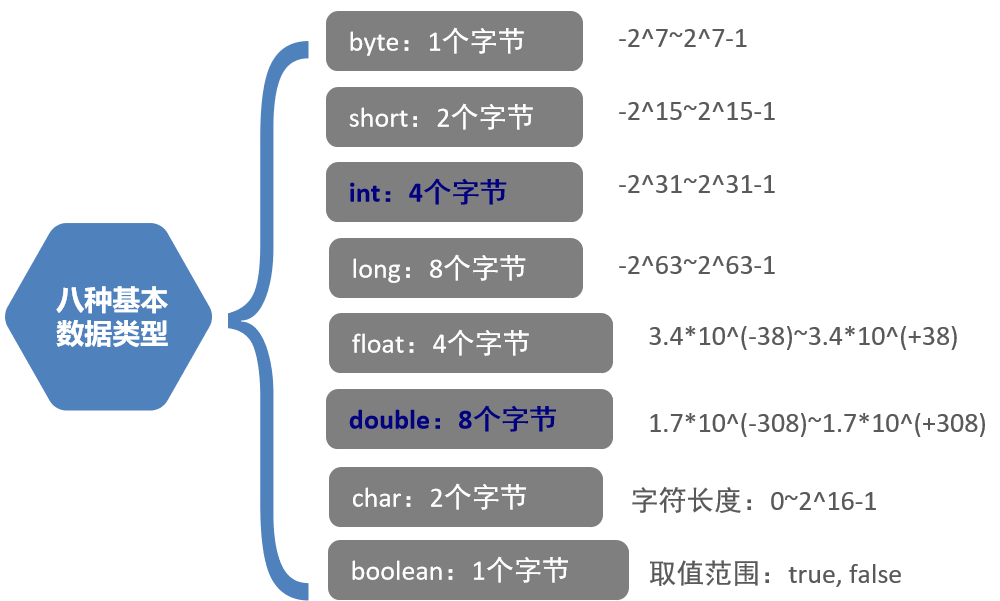

### 今日内容介绍

* 计算机和计算机语言(了解)
* JRE和JDK以及安装(掌握)
* 常见的DOS命令(了解)
* 配置环境变量(掌握)
* 编写入门案例HelloWorld,以及处理入门案例中经常出现的问题(掌握)
* Java的注释(掌握)
* 关键字概念以及常用的关键字(掌握)
* 常量的分类(掌握)
* 变量以及定义格式(掌握)

---


### 1. 计算机基本概念(了解)

#### 1.1 计算机组成

计算机由`计算机硬件`和`计算机软件`组成.

* 计算机硬件: 你的眼睛能看的见, 你的手能摸得着的东西.

  * 中央处理器(CPU)
    * 由运算器和控制器组成.

  * 存储器
    * 内存: 内存条(代数, 睿频).(临时存储技术)
      * 特点:电脑关闭后,内存中的数据会消失
    * 外存: 硬盘(SSD: 固态硬盘, HSD: 混合盘, HDD: 机械硬盘), U盘.(持久化存储技术)
      * 电脑关闭后, 文件还在
  * 输入设备
    * 键盘, 鼠标
  * 输出设备
    * 显示器.

* 计算机软件: 能在计算机上运行的程序.

  * 系统软件: Windows操作系统, Mac操作系统, Linux操作系统.
  * 应用软件: 
    * 概述: 我们程序员用编程代码开发的软件.
    * 例如: Typora, 微信, QQ.


#### 1.2 语言简介

* 什么是语言(Language)? 

  * 指的就是人与人之间进行沟通, 交互的载体, 方式.

* 什么是计算机语言(Computer Language)?

  * 指的就是`人与计算机之间`进行交互的方式.

* 计算机语言的分类:

  1. 机器语言

     > 简单理解: 由二进制0, 1这样的指令组成.
     >
     > 例如: 10010表示 加法.

  2. 汇编语言

     > 简单理解: 用一些简单的字母表示二进制序列(0, 1)
     >
     > 例如: add表示 加法.
     >
     > 优点: 文件小, 执行速度快, **可以直接操作计算机的硬件**
     >
     > 弊端: 可读性和可移植性相对较差, 对程序员来讲, 门槛较高.

  3. 高级语言

     > 简单理解: 由一些纯英文字母(包含大小写) 和 一些特殊符号组成.
     >
     > 例如: +表示 加法.
     >
     > 优点: 语法相对简单, 可读性, 兼容性较强, 对程序员来讲, 门槛较低.
     >
     > 弊端: 种类繁多, 每种语言都有自己的语法, 每学一门语言, 都要学习新的语法.

     **分类**

     * 第一代高级语言:

       例如: C语言, 以`面向过程`为编程思想, **唯一一门可以直接操作计算机硬件的高级语言**

     * 第二代高级语言:

       例如: C++, 以`面向对象`为编程思想, 没有默认的垃圾回收机制.

     * 第三代高级语言:   **目前市场上应用最多的语言**

       例如: Java, C#, 以`面向对象`为编程思想, 而且有默认的垃圾回收机制(GC).

     * 第四代高级语言:  **未来的发展趋势, 现在还处于发展初期**

       简单理解: 以`面向问题编程思想为主`, 也就是说: 告诉计算机做什么, 而不是怎么做. 

       例如: `Siri语言交互`, `大数据云平台`,  这些势必肯定会用到`大数据框架等技术`.


#### 1.3 Java语言

**概述**

- Sun公司(Stanford University NetWork: 美国的斯坦福大学)在1995年推出的高级编程语言.
- Java之父:  詹姆斯·高斯林(James Gosling)
- Sun公司在2009年被甲骨文(Oracle)公司给收购了.

**平台版本**

* J2SE: 标准版, 也是其他两个版本的基础. 在JDK1.5的时候正式更名为: JavaSE.
* J2ME: 小型版, 一般用来研发嵌入式程序. 已经被Android替代了. 在JDK1.5的时候正式更名为: JavaME.
* J2EE: 企业版, 一般开发企业级互联网程序. 在JDK1.5的时候正式更名为: JavaEE.

**特点**

- 开源

  > 指的是Java源代码是开放的. 

- 跨平台

  > 指的是: 用Java代码编写的程序, 可以在不同的操作系统上运行. 
  >
  > **原理:** 由JVM保证Java程序的跨平台性, 但是JVM本身并不能跨平台. 
  >
  > 图解: 
  >
  > 

- 多态

- 多线程

- 面向对象


### 2. JDK和JRE(掌握)

#### 2.1 概述

* JDK: Java开发工具包(Java Development Kit), 包含开发工具 和 JRE.

  * 常用的开发工具:  javac,   java

* JRE: Java运行时环境(Java Runtime Environment), 包含运行Java程序时所需的核心类库和 JVM.

  * 核心类库: java.lang,  java.util, java.io

* JVM: Java虚拟机(Java Virtual Machine)

  * 作用: 用来保证Java程序跨平台性的, 但是JVM本身并不能跨平台.

#### 2.2 图解


#### 2.3 Java环境搭建

* JDK的下载

  Oracle官网:  www.oracle.com

  直接下载JDK的地址: <https://www.oracle.com/java/technologies/javase/javase-jdk8-downloads.html>

* JDK的安装

  1. 傻瓜式安装(下一步下一步就可以了)

  2. 安装路径(以后但凡是安装开发软件, 都要满足以下两点: )
     * 不要直接安装到盘符目录下. 
     * 安装路径最好不要出现中文, 空格等特殊符号. 

  3. 目录解释:

     * bin: 存放的是编译器和工具

     - db: 存数数据
     - include: 编译本地方法.
     - jre: Java运行时文件
     - lib: 存放类库文件
     - src.zip: 存放源代码的.

* JDK的卸载

  去控制面板直接卸载就可以了. 

  > 小技巧:  windows徽标键 + 字母R  -> control -> 然后敲回车, 这样可以直接打开控制面板.


### 3. 常用的DOS指令(掌握)

#### 3.1 如何打开DOS窗口

windows徽标键 + 字母R -> 输入cmd -> 敲回车(enter键)

#### 3.2 常用的DOS指令

| 操作                    | 说明                              |
| ----------------------- | --------------------------------- |
| 盘符名称:               | 盘符切换。E:回车，表示切换到E盘。 |
| dir                     | 查看当前路径下的内容。            |
| cd 目录                 | 进入单级目录。cd itheima          |
| cd 目录1\目录2...       | 进入多级目录。cd itheima\JavaSE   |
| cd ..                   | 回退到上一级目录。                |
| cd \                    | 回退到盘符目录。                  |
| cls                     | 清屏。                            |
| exit                    | 退出命令提示符窗口。              |
| color /help             | 设置控制台颜色, 例如:  color 3f   |
| ipconfig /all           | 查看本机IP地址.                   |
| ping ip地址或者网址  -t | 测试网络连接是否通畅.             |
| shutdown -s -f -t  时间 | 设置电脑定时关机(时间单位: 秒)    |
| shutdown -a             | 取消电脑的自动关机计划            |
| java -version           | 查看你安装的JDK版本的.            |


### 4. Path环境变量配置(掌握)

#### 4.1 目的

让我们可以在任意目录下都能使用**JDK提供的常用开发工具, 例如: javac, java**

#### 4.2 步骤

1. 新建一个系统变量: JAVA_HOME, 它的值就是你安装的JDK的路径(注意: 不要带bin这一级)

   

   > 注意: 变量值不要带`bin目录`.

2. 在path中配置你刚才设置好的JAVA_HOME环境变量.

   ```java
   格式:  %JAVA_HOME%\bin  
   ```

   > 解释: %JAVA_HOME%表示引入该系统变量的值, 即: C:\Software\OfficeSoftware\jdk1.8.0_112

3. 测试

   * 方式一: 在DOS窗口中输入"javac 或者 java", 能看到对应的一坨指令即可.
   * 方式二: 在DOS窗口中输入"java -version", 可以看到当前配置的JDK的版本. 


### 5. HelloWorld案例(掌握)

#### 5.1 程序的开发步骤

Java程序的开发步骤一共3步, 分别是: 

* 编写 ---->编写源码的过程(我们能看懂的, 但是jvm看不懂的)
* 编译---->将我们能看懂的代码翻译成jvm能看懂的东西
* 执行--->执行程序

图解:


#### 5.2 编写源代码

1. 在代码文件夹中创建`HelloWorld.java`文件.

2. 用记事本打开`HelloWorld.java`文件.

3. 在`HelloWorld.java`文件中编写如下内容:

   ```java
   public class HelloWorld {
   	public static void main(String[] args) {
   		System.out.println("Hello World!");
   		System.out.println("你好, 欢迎来到我的直播间, 记得刷礼物喲!");
   	}
   }
   ```

   > 注意: HelloWorld.java叫`源代码文件`, 是我们能看懂, 但是计算机看不懂的文件.

#### 5.3 编译

通过`javac`指令将`HelloWorld.java`文件编译成jvm认识的`HelloWorld.class`字节码文件.

**格式**

```java
//在DOS窗口中输入如下内容: 
javac HelloWorld.java
```

#### 5.4 执行

通过`java`指令, 让计算机执行`HelloWorld.class`字节码文件.

**格式**

```java
//在DOS窗口中输入如下内容: 
java HelloWorld
```

> 注意: 直接写文件名即可, 不需要写文件后缀名, 即: `.class`

#### 5.5 可能会遇到的问题

**Bug**

* 概述

  在电脑系统或程序中，隐藏着的一些未被发现的缺陷或问题统称为bug（漏洞）

* 解决方案

  多看, 多思考, 多尝试, 多总结

**遇到的问题**

1. 非法字符.

   > 注意: 我们使用的符号全部都是**英文状态下的符号**

2. 注意字母的大小写.

   > 注意: Java是严格区分大小写的. 也就是说: A和a不是一回事儿.

3. 文件后缀名的问题.

   > 千万不要出现  HelloWorld.java.txt 这种情况

4. 在编译或者运行时, 指令及文件名不要写错了.

   ```java
   //编译的格式
   javac HelloWorld.java
   //运行的格式
   java HelloWorld
   ```

#### 5.6 Notepad++软件

**常用的开发工具**

* 概述: 指的就是我们用来编写代码的程序.

* 分类:

  * windows操作系统自带的记事本.

  * 高级记事本(例如: Notepad++, Editplus)

    > 功能: 带行号, 关键字高亮显示, 代码折叠.

  * 高级的IDE(集成开发环境)

    > 指的是集**代码的编写, 编译, 运行, 调试**等功能为一体的软件.
    >
    > 分类:
    >
    > * Eclipse
    > * MyEclipse
    > * IDEA(我们在Day06的时候才会开始用)

* 我们前5天用`Notepad++`, 之后的一生用的都是`IDEA`.

* Notepad++软件需要设置一下`新建文件的格式`

  


### 6. 注释(掌握)

#### 6.1 概述

就是用来对程序进行解释和说明的文字.

> 大白话翻译: 注释是给我们程序员看的, 并不是给计算机看的. 注释是不会影响代码运行的

#### 6.2 分类

* 单行注释

  ```java
  //单行注释
  ```

* 多行注释

  ```java
  /*
  	多行注释
  	多行注释
  */
  ```

* 文档注释

  ```java
  /**
  	文档注释
  	文档注释
  */
  ```


### 7. 关键字(注释)


#### 7.1 概述

就是被Java语言赋予了特殊含义的单词.   

#### 7.2 特点

* 关键字是由纯英文字母组成的, 而且`全部都是小写`的.

  

* 常用的开发工具(Notepad++, IDEA)针对于关键字都会`高亮显示`.

#### 7.3 常用的关键字(目前了解即可)

* public:   公共的权限, 目前先了解即可.
* class: 表示在创建一个类.
* static: 表示静态的意思.
* void: 表示方法的返回值类型.

#### 7.4 定义Java源代码文件的格式

```java
//类名可以自定义.
public class 类名 {
    public static void main(String[] args) {
        System.out.println(这里的内容可以随便写);
    }
}
```

#### 7.5 补充: 保留字

* 概述: 

  >  现在还不是关键字的单词, 但是却具有关键字的意义, 在以后的JDK升级版本中, 可能会被升级为关键字的单词.

* 常见的保留字: 

  > goto, const


### 8. 常量(掌握)

#### 8.1 概述

指的是`在程序的执行过程中, 其值不能发生改变的量`.

#### 8.2 分类

* 自定义常量(目前先了解, 在面向对象的时候, 才会详细解释)

* 字面值常量

  > 解释: 根据字面意思就可以划分的常量.

  1. 整数常量.

     > 例如: 1, 2, 3, 11, 22, 521

  2. 小数常量.

     > 例如: 5.21,  13.14

  3. 字符常量.

     > 解释: 字符的意思是说只能有一个值, 而且要用`单引号括起来`
     >
     > 例如: 'A', 'B', 'c',  '10'(这样写会报错, 因为10是由1和0两个值组成的)

  4. 字符串常量.

     > 解释: 字符串常量值都要用`双引号括起来`
     >
     > 例如: "abc", "传智播客", "黑马程序员", "大数据"

  5. 布尔常量

     > 解释: 比较特殊, 值只有两个
     >
     > * true, 相当于`正确`
     > * false, 相当于`不正确`

  6. 空常量

     > 解释: 比较特殊, 值只有一个: null, 表示什么都没有.
     >
     > 注意: 空常量不能通过输出语句直接打印. 
     >
     > 
     
     
     
     #### 常量的案例-打印所有的常量(除了null)
     
     ```java
     public class ConstantsDemo{
     	
     	//编写入口函数
     	public static void main(String[] args){
     		// 向控制台输出, 所有的常量
     		//1. 输出整数常量
     		System.out.println(12);
     		System.out.println(-12);
     		//2.输出小数常量
     		System.out.println(3.1415926);
     		//3.输出字符常量 ---> 必须用单引号引起来, 而且要求只能有一个字符
     		System.out.println('a');
     		//System.out.println('ab'); //典型错误写法, 单引号中有且只能有一个字符
     		//4.输出字符串常量 --->字符串常量必须用双引号引起来
     		System.out.println("我好帅, 你们同意吗???");
     		//5.输出boolean常量
     		System.out.println(true);
     		System.out.println(false);
     		//6.null常量, 他不能直接输出, 他是引用数据类型的默认值
     	}
     }
     ```
     
     

### 9.变量(掌握)

#### 	9.1 概述

* 在程序的执行过程中, 其值可以在某个范围内发生改变的量就叫`变量`. 

* 从本质上讲, 变量其实是内存中的一小块区域. 例如:  

  * 商品的价格（5元，6元，4元）
  * 钟表的时间（5点，6点，6点半）
  * 人们的年龄（0岁，10岁，18岁……80岁）
  * 程序员生涯的职位（开发工程师，开发经理，项目经理，CTO）

* Java中要求一个变量每次只能保存一个数据，而且必须要明确保存数据的数据类型。

  > **解释:**
  >
  > * **数据类型：**变量变化的范围就是数据类型
  > * **变量名：**每个变量都有一个名字，方便存取。
  > * **初始化值：**使用变量前，需要给变量赋值。

#### 9.2 示例一: 变量入门

**需求**

定义变量, 记录班级的学生人数, 并将结果打印到控制台上.

**参考代码**

```java

```


#### 9.3 数据类型

Java是一种`强类型语言`,  针对于每一个数据都给出了明确的数据类型.

> 解释:
>
> 区分一门语言到底是强类型语言还是弱类型语言的依据是: 看这门语言对数据的数据类型划分是否精细.
>
> 如果精细, 则是强类型语言,  如果不精细, 则是弱类型语言. 

##### 2.3.1 数据类型的分类

* 基本数据类型(简称: 基本类型)
  * byte, short, char, int, long, float, double, boolean
* 引用数据类型(简称: 引用类型)
  * `String, 数组, 类, 接口`,  目前先了解, 后续会详细讲解. 

##### 2.3.2 数据类型的分类图解


##### 2.3.3 数据类型的取值范围图解



**记忆**

> 1. `byte类型`的取值范围是: **-128 ~ 127**,` char类型`的取值范围是: **0 ~ 65535**
> 2. 默认的整形是: `int类型`, 默认的浮点型(即: 小数类型)是: `double类型.`
> 3. 定义long类型的数据时, 数据后边要`加字母L(大小写均可), 建议加L`
> 4. 定义float类型的数据时, 数据后边要`加字母F(大小写均可), 建议加F`


#### 9.4 格式

* 方式一: 声明变量并赋值. 

  ```java
  数据类型 变量名 = 初始化值;
  
  //示例: 声明(定义)一个int类型的变量, 变量名叫a, 初始化值为: 10
  int a = 10;
  ```

* 方式二: 先声明, 后赋值.

  ```java
  数据类型 变量名;
  变量名 = 初始化值;
  
  //示例
  //1. 声明(定义)一个int类型的变量, 变量名叫a
  int a;						
  //2. 把数字10赋值给变量a	  
  a = 10;						
  ```

#### 9.5 示例二: 定义变量并打印

**需求**
定义变量, 分别记录上述的8种基本类型数据, 并将变量值打印到控制台上.

**思路分析**

​	通过**声明变量并赋值**的方式实现.

```java

```

**思考题:** 先**声明后赋值**的实现方式如何做?

```java

```


#### 9.6 注意事项

​	

1. 变量参数运算是其值在参与运算

2. 变量未赋值，不能使用.

3. 变量只在它所属的范围内有效.

4. 一行上可以定义多个变量，但是不建议.

5. 整数默认是int类型的,小数默认是double类型,定义float的时候注意加F, 定义Long类型的话注意加L

6. java中存在常量优化机制

    

```java

```

### 10. 标识符(理解)

#### 10.1 概述

标识符就是用来给`类, 接口, 方法, 变量, 包`等起名字的规则. 

#### 10.2 命名规则

1. 标识符只能包含`52个英文字母(区分大小写)`、`0 ~ 9数字` 、`$（美元符号）`和`_（下划线）`。

2. 标识符不能以数字开头。

3. 标识符不能和Java中的关键字重名。

4. 最好做到`见名知意`.

   > 例如: name表示姓名, age表示年龄. 

#### 10.3 命名规范

1. 类, 接口的命名规范:  每个单词的首字母都大写, 其他字母全部小写.(大驼峰命名法)

   > 例如: HelloWorld,   VariableDemo.

2. 变量, 方法的命名规范: 从第二个单词开始, 每个单词的首字母都大写, 其他字母全部小写(小驼峰命名法).

   > 例如: zhangSanAge, studentName

3. 常量(指的是: 自定义常量)的命名规范:  所有字母都大写, 单词之间用`_(下划线)`隔开.

   > 例如: MAX_VALUE, MIN_VALUE, PI
   >
   > 注意: 目前先了解即可, 面向对象部分详细解释.

4. 包的命名规范: 所有字母全部小写, 多级包之间用`.(点符号)`隔开, 一把是公司的域名反写.

   > 例如: cn.itcast,   com.itheima.

#### 10.4 示例

**需求**

定义变量分别记录张三的年龄和性别(假设: 23, 男), 然后将变量值打印到控制台上.

**参考代码**

```java
//1. 定义一个类, 类名叫: VariableDemo06
public class VariableDemo06 {
    //2. 定义main方法, 作为程序的主入口.
    public static void main(String[] args) {
        //3. 定义变量, 记录张三的年龄.
        int zhangSanAge = 23;
        //4. 定义变量, 记录张三的性别.
        char zhangSanSex = '男';
        //5. 打印年龄.
        System.out.println(zhangSanAge);
        //6. 打印性别.
        System.out.println(zhangSanSex);
    }
}
```


