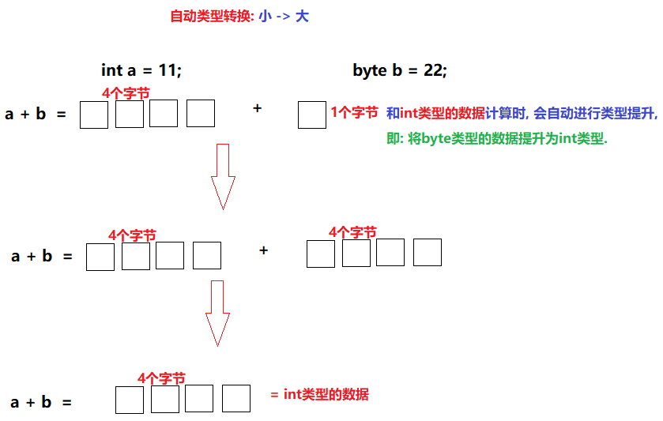
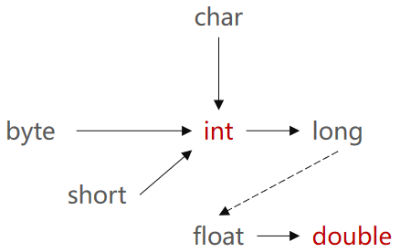
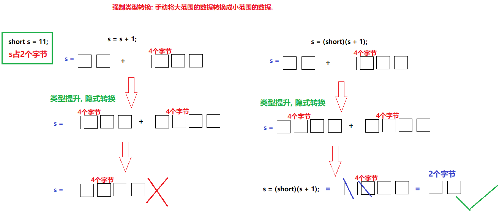

### 今日目标

* 掌握变量相关的知识点
* 掌握数据类型转换
* 掌握运算符的用法

---

### 1.基础知识-单位换算

- 1 B = 8 bit

- 1 KB = 1024 B

- 1 MB = 1024 KB

- 1 GB = 1024 MB 

- 1 TB = 1024 GB 

- 1 PB = 1024 TB

- 1 EB = 1024 PB

- 1 ZB = 1024 EB

- 1 YB = 1024 ZB

- 1 BB = 1024 YB

- 1 NB = 1024 BB

- 1 DB = 1024 NB


### 2. 数据类型转换

#### 2.1 概述

不同类型的数据之间可能会进行运算，而这些数据取值范围不同，存储方式不同，直接进行运算可能会造成数据损失，所以需要将一种类型转换成另外一种类型再进行运算。

> 即: Java程序中要求参与计算的数据，必须保证数据类型的一致性，如果数据类型不一致将发生`类型转换`。

#### 2.2 分类

* 自动（隐式）类型转换
* 强制（显式）类型转换

#### 2.3 自动(隐式)类型转换

指的是**小类型转大类型，会自动提升为大类型，运算结果是大类型.**

> 大白话翻译: 将`取值范围小的类型`自动提升为`取值范围大的类型`

##### 2.3.1 需求

1. 定义两个int类型的变量a和b, 分别赋值为10, 20.
2. 通过输出语句打印变量a和b的和.
3. 定义int类型的变量c, 接收变量a和b的和. 
4. 打印变量c的值.
5. 定义两个变量aa和bb, 一个是int类型的数据, 另一个是byte类型的数据.
6. 定义变量cc接收 变量aa和bb的和.
7. 分别设置变量cc的数据类型为byte类型和int类型, 观察结果并打印.

##### 2.3.2 参考代码

```java
public class DataTypeDemo01 {
    public static void main(String[] args) {
        //1. 定义两个int类型的变量a和b, 分别赋值为10, 20.
        int a = 10;
        int b = 20;
        //2. 通过输出语句打印变量a和b的和.
        System.out.println(a + b);
        //我可以把a + b的结果进行输出, 说明这个计算结果是没有问题的.
        //那么, 我应该也可以把这个结果接收一下.

        //3. 定义int类型的变量c, 接收变量a和b的和.
        int c = a + b;
        //4. 打印变量c的值.
        System.out.println(c);
        System.out.println("-----------");

        //5. 定义两个变量aa和bb, 一个是int类型的数据, 另一个是byte类型的数据.
        int aa = 11;
        byte bb = 22;
        //6. 定义变量cc接收 变量aa和bb的和.
        int cc = aa + bb;
        //byte cc = aa + bb;    //这行代码会报错. 
        //7. 分别设置变量cc的数据类型为byte类型和int类型, 观察结果并打印.
        System.out.println(cc);
    }
}
```

##### 2.3.3 解释

当`byte类型的数据`和`int类型的数据`的数据进行计算时, 会自动将`byte类型的数据提升为int类型`, 然后再计算. 



##### 2.3.4 思考

1. 如果是int类型的数据和double的数据相加, 结果是什么类型?

   double

2. 如果是char类型的数据和int类型的数据相加, 结果是什么类型?

   int

3. 如果是boolean类型的数据和int类型的数据相加, 结果是什么类型?

   语法错误, boolean值不参与类型转换,没办和其他7种数据类型玩

#####  2.3.5 结论

**转换规则为:** 

1. 范围小的类型向范围大的类型提升，`byte、short、char` 运算时直接提升为`int` 。
2. boolean类型的数据只有`true和false这两个`, 所以boolean类型的数据不参与类型转换.

> 即: byte、short、char-->int-->long-->float-->double
>
> 图解: 
>
> 

#### 2.4 强制（显式）类型转换

指的是**手动将大类型转换成小类型，运算结果是小类型.** 

> 大白话翻译: 将`取值范围大的类型`强制转换成`取值范围小的类型`.

##### 2.4.1 需求

尝试把小数1.5赋值给int类型的变量a, 并打印结果. 

##### 2.4.2 参考代码

```java
public class DataTypeDemo02 {
    public static void main(String[] args) {
        //1. 定义int类型的变量a.
        int a;
        //2. 尝试将1.5赋值给变量a.
        //这行代码会报错, 大范围的数据赋值给小范围的数据类型, 必须通过`强制转换`格式实现.
        //a = 1.5;
        a = 10;     //这样写没问题.
        //3. 打印结果.
        System.out.println(a);
    }
}
```

##### 2.4.3 解释

* `double` 类型占8个字节，`int` 类型占4个字节。
* `1.5` 是`double` 类型，取值范围大于`int` 。
* 可以理解为`double` 是8升的水壶，`int` 是4升的水壶，不能把大水壶中的水直接放进小水壶去。
* 想要赋值成功，只有通过强制类型转换，将`double` 类型强制转换成`int` 类型才能赋值。
* 比较而言，自动转换是Java自动执行的，而强制转换需要我们自己手动执行。

##### 2.4.4 强制转换格式

```java
数据类型 变量名 = （数据类型）要被转换的数据值；

//示例: 将1.5赋值给int类型，代码修改为：
int a = (int)1.5;
```

##### 2.4.5 思考题

下述代码会不会报错, 如果会, 哪一行会报错, 为什么? 怎么修改代码? 

```java
public class DataTypeDemo03 {
    public static void main(String[] args) {
        short s = 11;
        s = s + 3;// 将s的值 + 3 在存入s里面
        s = (short)(s + 3);
        System.out.println(s);
    }
}
```

##### 2.4.6 图解



##### 2.4.7 注意事项

* byte , short , char 在参与数学运算时, 默认会先提升成int类型
* 尽量不要使用或者不用强制类型转换, 因为有可能损失精度!!!!

### 3. ASCII码表

观察下述代码, 打印结果是多少呢? 

```java
public static void main(String[] args) {
  //字符类型变量
  char c = 'a';
  int i = 1;
  //字符类型和int类型计算
  System.out.println(c+i);  //输出结果是???
}
```

在计算机的内部都是二进制的0, 1数据，如何让计算机可以直接识别人类文字呢？

于是就产生出了`编码表`的概念。

- **编码表**：就是将人类的文字和一个十进制数进行对应起来组成一张表格。
- **存储字符时**：需要查找ASCII码表,找到字符对应的数字,将数字转换为二进制数存放到计算机中
- **使用字符时**：将对应的二进制数转换为十进制 找到ASCII表中对应的字符 显示出来
- 将所有的英文字母，数字，符号都和十进制进行了对应，因此产生了世界上第一张编码表`ASCII码表`.
- ASCII（American Standard Code for Information Interchange 美国标准信息交换码）, 规则如下: 

| 字符 | 数值 |
| :--: | :--: |
|  0   |  48  |
|  9   |  57  |
|  A   |  65  |
|  Z   |  90  |
|  a   |  97  |
|  z   | 122  |

> 注意：
>
> 在char类型和int类型计算的过程中，char类型的字符先查询编码表，得到97，再和1求和，结果为98。
>
> char类型提升为了int类型。char类型内存2个字节，int类型内存4个字节。


### 4.  运算符

#### 4.1 概述

- 运算符和表达式

  - 运算符：用来连接常量或者变量的符号, 就叫`运算符`.

  - 表达式：用运算符把常量或者变量连接起来`符合java语法的式子`就称之为表达式。

    int a = 10;

    int b = 20;

    int c = a + b;

- 不同运算符连接的表达式体现的是不同类型的表达式。

  >  例如: 
  >
  > * `+(加号)` 是运算符，并且是算术运算符。
  > * a + b：是表达式，由于+是算术运算符，所以这个表达式叫算术表达式。

#### 4.2 分类

* 算术运算符
* 赋值运算符
* 比较(关系)运算符
* 逻辑运算符
* 三元(三目)运算符
* 位运算符


#### 4.3 算数运算符

算术运算符指的是用来对变量或者常量进行`算术操作的`, 例如: 加减乘除等. 

##### 4.3.1 分类

| 算数运算符包括： | 作用                         |
| ---------------- | ---------------------------- |
| `+`              | 加法运算，字符串连接运算     |
| `-`              | 减法运算                     |
| `*`              | 乘法运算                     |
| `/`              | 除法运算                     |
| `%`              | 取模运算，两个数字相除取余数 |
| ++               | 自增运算符, 相当于自身 + 1   |
| --               | 自减运算符, 相当于自身 - 1   |

##### 4.3.2 注意

* Java中, 整数相除, 结果还是整数. 

- `+` 符号在字符串中的操作：
  - `+` 符号在遇到字符串的时候，表示**连接、拼接**的含义。
  - "a"+"b"的结果是“ab”，连接含义

```java
public static void main(String[] args){
 	System.out.println("5+5=" + 5 + 5);
    System.out.println(5 + 5 + "=5+5" );
    System.out.println('a'+ 1 +"abc" );// 98abc
    System.out.println('a' + "abc" + 1 );//aabc1
    System.out.println('a' + "abc" + 1 );//aabc1
}
```


#### 4.4 赋值运算符

| 符号 | 作用       | 说明                  |
| ---- | ---------- | --------------------- |
| `=`  | 赋值       | a=10，将10赋值给变量a |
| `+=` | 加后赋值   | a+=b，将a+b的值给a    |
| `-=` | 减后赋值   | a-=b，将a-b的值给a    |
| `*=` | 乘后赋值   | a*=b，将a×b的值给a    |
| `/=` | 除后赋值   | a/=b，将a÷b的商给a    |
| `%=` | 取余后赋值 | a%=b，将a÷b的余数给a  |

- 赋值运算符，就是将符号右边的值，赋给左边的变量。

```java
public static void main(String[] args){
    int i = 5;
    i+=5;//计算方式 i=i+5 变量i先加5，再赋值变量i
    System.out.println(i); //输出结果是10 
}
```

- +=符号的扩展

下面的程序有问题吗？

```java
public static void main(String[] args){
  short s = 1;
  s+=1;
  System.out.println(s);
}
```

分析： `s += 1` 逻辑上看作是`s = s + 1` 计算结果被提升为int类型，再向short类型赋值时发生错误，因为不能将取值范围大的类型赋值到取值范围小的类型。但是，`s=s+1进行两次运算`，`+=` 是一个运算符，只运算一次，并带有强制转换的特点，也就是说`s += 1` 就是`s = (short)(s + 1)`，因此程序没有问题编译通过，运行结果是2.


#### 4.5 自增自减运算符

| 符号 | 作用 | 说明        |
| ---- | ---- | ----------- |
| ++   | 自增 | 变量的值加1 |
| --   | 自减 | 变量的值减1 |

- `++`  **运算，变量自己增长1**。反之，`--` **运算，变量自己减少1**，用法与`++` 一致。

  - 独立运算：

    - 变量在独立运算时，`前++`和`后++`没有区别 。
    - 变量`前++`   ：例如 `++i` 。
    - 变量`后++`   ：例如 `i++` 。

  - 混合运算：

    - 和其他变量放在一起，`前++`和`后++`就产生了不同。
    - 变量`前++` ：变量a自己加1，将加1后的结果赋值给b，也就是说a先计算。a和b的结果都是2。

    ```java
    public static void main(String[] args) {
        int a = 1;
        int b = ++a;
        System.out.println(a);//计算结果是2
        System.out.println(b);//计算结果是2
    }
    ```

    - 变量`后++` ：变量a先把自己的值1，赋值给变量b，此时变量b的值就是1，变量a自己再加1。a的结果是2，b的结果是1。

    ```java
    public static void main(String[] args) {
        int a = 1;
        int b = a++;
        System.out.println(a);//计算结果是2
        System.out.println(b);//计算结果是1
    }
    ```

#### 4.6. 关系运算符(比较运算符)

##### 4.6.1 概述

关系运算符就是用来描述`两个变量或者常量之间的关系的.`主要分为以下6种: 

| 符号 | 说明                                                    |
| ---- | ------------------------------------------------------- |
| ==   | a==b，判断a和b的值是否相等，成立为true，不成立为false   |
| !=   | a!=b，判断a和b的值是否不相等，成立为true，不成立为false |
| >    | a>b，判断a是否大于b，成立为true，不成立为false          |
| >=   | a>=b，判断a是否大于等于b，成立为true，不成立为false     |
| <    | a<b，判断a是否小于b，成立为true，不成立为false          |
| <=   | a<=b，判断a是否小于等于b，成立为true，不成立为false     |

##### 4.6.2 注意事项

* 关系运算符的结果都是boolean类型，要么是true，要么是false。
* 千万不要把`==`写成了`=`, 否则结果可能不是你想要的. 

##### 4.6.3 案例

**需求**

1. 定义两个int类型的变量a和b, 分别赋值为10和5.
2. 通过**关系运算符**比较这两个变量之间的关系, 并打印结果.

**参考代码**

```java
public class OperatorDemo01 {
    public static void main(String[] args) {
        //定义两个int类型的变量a和b, 分别赋值为10和5.
        int a = 10;
        int b = 5;
        //通过`关系运算符`比较这两个变量之间的关系, 并打印结果.
        System.out.println(a > b);
        System.out.println(5 >= 5);
        System.out.println(a < b);
        System.out.println(5 <= 5);
        System.out.println(a != b);
        System.out.println(a == b);
        System.out.println(a = b);
        
        //关系运算符的最终结果是boolean类型, 所以我们也可以用boolean类型的变量接收.
        boolean flag = 10 < 5;
        System.out.println(flag);
    }
}
```


#### 4.7. 逻辑运算符

##### 4.7.1 概述

* 逻辑运算符是用来判断**并且, 或者, 非**等逻辑关系的符号. 

* 该符号两端一般连接值为布尔类型的关系表达式

  > 例如: 某企业招工, 要求年龄必须在 20 ~ 65岁之间. 

##### 4.7.2 分类

> 注意: 假设下表中的a和b, 都是boolean类型的值. 

| 符号 | 作用     | 说明                                                         |
| ---- | -------- | ------------------------------------------------------------ |
| &    | 逻辑与   | a&b，并且的意思. 有false则整体为false,  都为true, 则整体为true. |
| \|   | 逻辑或   | a\|b，或者的意思, 有true则整体为true, 都为false, 则整体为false. |
| !    | 逻辑非   | !a，取反的意思, 以前为true, 取反后为false, 以前为false, 取反后为true. |
| ^    | 逻辑异或 | a^b，异同的意思, 相同为false, 不同为true.                    |

> 小技巧:
>
> 对一个布尔数据, 偶数次取反, 该数据值不变.
>
> !true = false

##### 4.7.3 示例: 逻辑运算符入门

**需求**

1. 定义三个int类型的变量a, b, c, 它们的初始化值分别为10, 20, 30.
2. 通过上述的三个变量, 演示各个逻辑运算符.

**参考代码**

```java
public class OperatorDemo02 {
    public static void main(String[] args) {
        int a = 10, b = 20, c = 30;
        //&: 逻辑与, 并且的意思, 有false则整体为false.
        //相当于: 班长找女朋友, 要求长得漂亮, 并且身材好.
        System.out.println((a > b) & (a > c)); //false & false
        System.out.println((a < b) & (a > c)); //true & false
        System.out.println((a > b) & (a < c)); //false & true
        System.out.println((a < b) & (a < c)); //true & true
        System.out.println("-----------------");

        //|: 逻辑或, 或者的意思, 有true则整体为true.
        //相当于: 降低条件了, 要么长得漂亮, 要么身材好.
        System.out.println((a > b) | (a > c)); //false | false
        System.out.println((a < b) | (a > c)); //true | false
        System.out.println((a > b) | (a < c)); //false | true
        System.out.println((a < b) | (a < c)); //true | true
        System.out.println("-----------------");

        //!: 逻辑非, 取反的意思
        //相当于: 只要不是男的就行.
        System.out.println(!(a > b));   //!false
        System.out.println(!(a < b));   //!true
        System.out.println("-----------------");

        //逻辑异或, 异同的意思, 相同为false, 不同为true.
        //相当于: 最后还是找了个男的, 但是领不了证.
        //法律规定: 一夫一妻, 一男一女, 必须是异性才能领证.
        System.out.println((a > b) ^ (a > c)); //false ^ false
        System.out.println((a < b) ^ (a > c)); //true ^ false
        System.out.println((a > b) ^ (a < c)); //false ^ true
        System.out.println((a < b) ^ (a < c)); //true ^ true
    }
}
```


##### 4.7.4 短路逻辑运算符

在实际开发中, `并且, 或者`这样的操作是非常多的, 但是上述的`&(逻辑与), !(逻辑或)`运算符`没有短路效应`, 所以效率相对较低, 针对这种情况, 我们可以使用`&&(短路与), ||(短路或)`来优化.

###### 4.7.4.1 格式

| 符号 | 作用   | 说明                                                    |
| ---- | ------ | ------------------------------------------------------- |
| &&   | 短路与 | 作用和&相同，但是有短路效果, 前边出现false, 后边不执行. |
| \|\| | 短路或 | 作用和\|相同，但是有短路效果, 前边出现true, 后边不执行. |

###### 4.7.4.2解释

* 在**短路与**运算中，只要有一个表达式的值为false，那么结果就可以判定为false了，没有必要将所有表达式的值都计算出来，短路与运算符就有这样的效果，可以提高效率。
* 同理在**短路或**运算中，一旦发现值为true，右边的表达式将不再参与运算。

###### 4.7.4.3 短路和非短路之间的区别

* 逻辑与 和 短路与之间的区别
  * 逻辑与&(也叫单与):    无论左边真假，右边都要执行。
  * 短路与&&(也叫双与): 如果左边为真，右边执行；如果左边为假，右边不执行。

* 逻辑或 和 短路或之间的区别
  * 逻辑或|(也叫单或):   无论左边真假，右边都要执行。
  * 短路或||(也叫双或): 如果左边为假，右边执行；如果左边为真，右边不执行。
* 记忆: 在实际开发中, **我们用的最多的逻辑运算符就是: &&, ||, !**

###### 4.7.4.4 案例

**需求**

证明&和&&的区别

**参考代码**

```java
public class OperatorDemo03 {
    public static void main(String[] args) {
        //1. 定义两个int类型的变量a和b, 初始化值分别为: 2, 5
        int a = 2, b = 5;
        //2. 演示逻辑与(&)
       /* System.out.println((a++ > 2) & (b++ < 7)); //两个表达式都会执行.
        System.out.println(a);
        System.out.println(b);*/
        System.out.println("------------------");

        //3. 演示短路与(&&)
        System.out.println((a++ > 2) && (b++ < 7)); //左边表达式结果为false, 右边不执行.
        System.out.println(a);
        System.out.println(b);
    }
}
```


#### 4.8. 三元运算符

##### 4.8.1 格式

三元运算符也叫`三目运算符`，即由三部分组成，格式如下：

```java
(关系表达式) ? 表达式1：表达式2； 
```

4.8.2 执行流程

1. 先执行关系表达式, 看其结果是true还是false.
2. 如果是`true`, 则执行`表达式1`
3. 如果是`false`, 则执行`表达式2`

##### 4.8.3 案例一: 入门案例

**需求**

1. 定义两个int类型的变量a. b, 初始化值分别为10, 20
2. 通过三元运算符, 获取变量a和b的最大值.
3. 将结果(最大值)打印到控制台上.

**参考代码**

```java
public class OperatorDemo04 {
    public static void main(String[] args) {
        //1. 定义两个int类型的变量a. b, 初始化值分别为10, 20
        int a = 10, b = 20;
        //2. 通过三元运算符, 获取变量a和b的最大值.
        int max = a < b ? b : a;
        //3. 将结果(最大值)打印到控制台上.
        System.out.println(max);
    }
}
```


##### 4.8.4 案例二: 判断老虎体重

**需求**

动物园里有两只老虎，已知两只老虎的体重分别为180kg、200kg，请用程序实现判断两只老虎的体重是否相同。

**参考代码**

```java
public class OperatorDemo05 {
    public static void main(String[] args) {
        //1：定义两个变量用于保存老虎的体重，单位为kg，这里仅仅体现数值即可。
        int weight1 = 180;
        int weight2 = 200;
        //2：用三元运算符实现老虎体重的判断，体重相同，返回true，否则，返回false。
        boolean flag = weight1 == weight2 ? true : false;
        //3：输出结果
        System.out.println("flag:" + flag);
    }
}
```


##### 4.8.5  案例三: 获取和尚的最高身高

**需求**

1. 一座寺庙里住着三个和尚，已知他们的身高分别为150cm、210cm、165cm.

2. 请用程序实现获取这三个和尚的最高身高。

**参考代码**

```java
public class OperatorDemo06 {
    public static void main(String[] args) {
        //1：定义三个变量用于保存和尚的身高，单位为cm，这里仅仅体现数值即可。
        int h1 = 150;
        int h2 = 210;
        int h3 = 165;
        //2：用三元运算符获取前两个和尚的较高身高值，并用临时身高变量保存起来。
        int temp = h1 > h2 ? h1 : h2;
        //3：用三元运算符获取临时身高值和第三个和尚身高较高值，并用最大身高变量保存。
        int max = temp > h3 ? temp : h3;
        //4：输出结果
        System.out.println("这三个和尚中身高最高的是：" + max +"cm");
    }
}
```

### 5. 键盘录入

#### 5.1 概述

之前我们涉及到的数据都是`写死的, 固定的数据`, 这样做用户体验并不好, 我们就想着, 能不能让用户录入数据, 我们通过特定的代码来接收, 这样做就非常好玩儿了, 针对于这种情况, 我们可以通过`键盘录入`来实现.

> 即: Java中键盘录入功能指的就是Scanner类, 我们可以通过它的一些方法, 来获取用户录入的数据.

#### 5.2 使用步骤

1. 导包.    包就是文件夹.

   > 注意: 
   >
   > * Scanner类是java.util包下的类, 使用之前必须要先导包.
   >
   > * 导包的语句是定义在类的上面的, 格式如下:
   >
   >   ```java
   >   import java.util.Scanner;
   >   ```

2. 创建Scanner类的对象, 格式为:

   ```java
   //暂时先理解为固定格式, 也就是必须这么写.
   Scanner sc = new Scanner(System.in);
   ```

3. 通过`Scanner类的nextInt()方法`接收用户录入的数据.

   ```java
   int a = sc.nextInt();
   ```

#### 5.3 案例一: Scanner入门

**需求**

1. 提示用户录入他/她的年龄.
2. 通过键盘录入功能, 接收用户录入的年龄.
3. 将用户录入的数据(年龄)打印到控制台上.

**参考代码**

```java
//导包
import java.util.Scanner;

public class ScannerDemo01 {
    public static void main(String[] args) {
        //1. 提示用户录入他/她的年龄.
        System.out.println("请录入您的年龄: ");
        //2. 通过键盘录入功能, 接收用户录入的年龄.
        Scanner sc = new Scanner(System.in);
        int age = sc.nextInt();
        //3. 将用户录入的数据(年龄)打印到控制台上.
        System.out.println("age: " + age);
    }
}
```


#### 5.4 案例二: 键盘录入版和尚身高

**需求**

1. 提示用户录入第一个和尚的身高, 并接收
2. 提示用户录入第二个和尚的身高, 并接收
3. 提示用户录入第三个和尚的身高, 并接收.
4. 通过三元运算符, 获取三个和尚中身高最矮的那个和尚的身高.
5. 将结果(最低身高)打印到控制台上. 

**参考代码**

```java
import java.util.Scanner;

public class ScannerDemo02 {
    public static void main(String[] args) {
        //身高未知，采用键盘录入实现。首先导包，然后创建对象。
        Scanner sc = new Scanner(System.in);
        //键盘录入三个身高分别赋值给三个变量。
        System.out.println("请输入第一个和尚的身高：");
        int h1 = sc.nextInt();
        System.out.println("请输入第二个和尚的身高：");
        int h2 = sc.nextInt();
        System.out.println("请输入第三个和尚的身高：");
        int h3 = sc.nextInt();
        //用三元运算符获取前两个和尚的较低身高值，并用临时身高变量保存起来。
        int temp = h1 < h2 ? h1 : h2;
        //用三元运算符获取临时身高值和第三个和尚身高较低值，并用最低身高变量保存。
        int min = temp < h3 ? temp : h3;
        //输出结果。
        System.out.println("这三个和尚中身高最低的是：" + min +"cm");
    }
}
```

