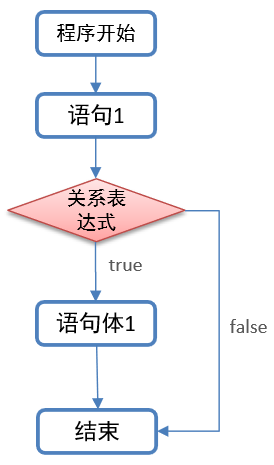
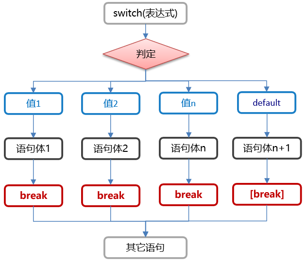

### 今日目标

* 了解顺序结构的相关概述
* 掌握选择结构之if语句相关知识点
* 掌握选择结构之switch语句相关知识点
* 掌握循环结构之for语句相关的知识点
* 掌握循环结构之wihle语句相关的知识点
* 了解循环结构之do while语句相关知识点
* 掌握循环跳转的关键字

---


### 1. 流程控制

#### 1.1 概述

在一个程序执行的过程中，各条语句的执行顺序对程序的结果是有直接影响的。所以，我们必须清楚每条语句的执行流程。而且，很多时候要通过控制语句的执行顺序来实现我们想要的功能。

例如: 某些代码是满足特定条件的情况下, 才会被执行.  而有些代码, 在满足某些条件的情况下, 需要重复执行, 这些, 都需要用到流程控制语句.

#### 1.2 分类

* 顺序结构
* 选择结构(if语句, switch.case语句)
* 循环结构(for循环, while循环, do.while循环)

#### 1.3 顺序结构

**概述**

**顺序结构**指的是代码是按照**从上往下, 从左往右**的顺序, 依次逐行执行的, 且**顺序结构也是Java程序的默认结构**.

**图解**


**需求**

定义类OrderDemo01, 在类中定义main方法, 打印如下数据:

```java
//start
//HelloWorld1
//HelloWorld2
//HelloWorld3
//end
```

**参考代码**

```java
public class OrderDemo01 {
    public static void main(String[] args) {
        //打印指定的数据
        System.out.println("start");
        System.out.println("HelloWorld1");
        System.out.println("HelloWorld2");
        System.out.println("HelloWorld13");
          System.out.println( 'a'+"abc" +'a');
        System.out.println("end");
    }
}
```


### 2.选择结构

#### 2. 1选择结构之if语句

##### 概述

如果我们想某些代码是在满足条件的情况下, 才能被执行, 此时就需要用到选择结构了, 选择结构也叫分支结构, 主要分为以下两种:

* if语句
* switch.case语句

##### 分类

if语句一般用于`范围`的判断, 例如: 如果当前时间是`0~8点, 小黑就和你说: 早上好`, 如果当前时间是`9 ~12点, 小黑就和你说: 中午好`. 根据应用场景的不同(即: 分支个数不同), if语句的格式主要分为以下三种:

1. if语句(也叫: 单分支)
2. if.else语句(也叫: 双分支)
3. if.else if语句(也叫: 多分支)

#####  单分支

单分支结构一般用来`判断一种情况`, 格式如下:

**格式**

```java
if(boolean表达式) {
    //语句体;
}
```

**执行流程**

1. 先执行boolean表达式, 看其结果是true还是false.
2. 如果是true, 则执行`大括号`中的语句体.
3. 如果是false, 则`大括号`中的语句体不执行.

**图解**



**需求**

定义变量time表示时间, 如果它的范围是在[0,8]之间, 就打印`早上好`, 否则不操作.

> 解释: [0, 8], 意思是说 0~8之间, 包含0, 也包含8, 这种写法属于"前闭后闭".
>
> [0, 8), 意思是: 0~8之间, 包含0, 不包含8, 这种写法属于"前闭后开", 也叫: 包左不包右.

**参考代码**

```java
public class IfDemo01 {
    public static void main(String[] args) {
        int time = 5;
        if(time >= 0 && time <= 8) {
            System.out.println("早上好");
        }
    }
}
```


##### 双分支

双分支结构指的是**if. else语句**, 一般用来`判断两种情况`, 格式如下:

######  格式

```java
if(boolean表达式) {	//if的意思: 如果
    //语句体1;
} else {	   //否则...
    //语句体2;
}
```

###### 执行流程

1. 先执行boolean表达式, 看其结果是true还是false.
2. 如果是true, 则执行语句体1.
3. 如果是false, 则执行语句体2.

######  图解


###### 案例

**案例一: if格式二入门**

**需求**

定义变量time表示时间, 如果它的范围是在0~8之间, 就打印`早上好`, 否则就打印`中午好`.

**参考代码**

```java
public class IfDemo02 {
    public static void main(String[] args) {
        int time = 5;
        if(time >= 0 && time <= 8) {
            System.out.println("早上好");
        } else {
            System.out.println("中午好");
        }
    }
}
```


**案例二: 判断奇偶数**

**需求**

1. 提示用户键盘录入一个数据并接收.
2. 判断该数据是奇数还是偶数, 并将结果打印到控制台上.

**参考代码**

```java
public class IfDemo03 {
    public static void main(String[] args) {
        Scanner sc = new Scanner(System.in);
        System.out.println("请录入一个整数: ");
        int num = sc.nextInt();
        if (num % 2 == 0) {
            System.out.println(num + "是偶数");
        } else {
            System.out.println(num + "是奇数");
        }
    }
}
```

**记忆**

1. if语句控制的语句体如果只有一行代码, 则该大括号可以省略不写.

   > 例如:
   >
   >  if(5 > 3)
   >
   > ​    System.out.println("夯哥最纯洁!");

2. if语句控制的语句体如果只有一行代码, 则该大括号可以省略不写, 定义变量的语法除外.

   > 例如:
   >
   >  if(5 > 3)
   >
   >    int a = 10;   //这样写会报错, jvm会识别这样代码为两行:  int a; a = 10;
   >
   > 上述的代码就相当于:
   >
   >  if(5 > 3) {
   >
   > ​    int a;
   >
   > }
   >
   > a = 10;    //这样写肯定会报错.

3. 你省略if后边的大括号时, 有个问题一定要注意, 不要乱写`分号`.

   >例如: 
   >
   >if(5 > 3) ;    //这里如果写分号了, 就意味着if语句结束了.
   >
   >   System.out.println("本意: 这行代码只有条件成立才会被执行");

##### 多分支

多分支结构指的是**if. else if语句**, 一般用来`判断多种情况`, 格式如下:

###### 格式

```java
if(关系表达式1) {
    //语句体1;
} else if(关系表达式2){
    //语句体2;
} else if(关系表达式3){	//这里可以根据需求, 有多个else if语句
    //语句体3;
} else {
    //语句体n;
}


if(关系表达式1) {
    //语句体1;
} else if(关系表达式2){
    //语句体2;
} else if(关系表达式3){	//这里可以根据需求, 有多个else if语句
    //语句体3;
}...
```

######  执行流程

1. 先执行关系表达式1, 看其结果是true还是false.
2. 如果是true, 则执行语句体1, 整个if语句结束.
3. 如果是false, 则判断关系表达式2, 看其结果是true还是false.
4. 如果是true, 则执行语句体2, 整个if语句结束.
5. 如果是false, 则判断关系表达式3, ...以此类推.
6. 如果所有的关系表达式都不成立, 则执行else语句的语句体n, 整个if语句结束.

######  图解


###### 案例

**案例一: 打印星期**

**需求**

1. 提示用户录入[1, 7]之间的数字, 并接收.
2. 根据用户录入的数字, 打印对应的星期, 格式如下:
   * 用户录入1, 打印"星期一"
   * 用户录入2, 打印"星期二"
   * ...以此类推
   * 用户录入非法数字, 打印"没有这样的日期"

**参考代码**

```java
import java.util.Scanner;

public class IfDemo04 {
    public static void main(String[] args) {
        Scanner sc = new Scanner(System.in);
        System.out.println("请录入一个1 - 7之间的整数: ");
        int week = sc.nextInt();
        if (week == 1) {
        } else if(week == 2) {
            System.out.println("星期二");
        } else if(week == 3) {
            System.out.println("星期三");
        } else if(week == 4) {
            System.out.println("星期四");
        } else if(week == 5) {
            System.out.println("星期五");
        } else if(week == 6) {
            System.out.println("星期六");
        } else if(week == 7) {
            System.out.println("星期日");
        } else {
            System.out.println("没有这样的日期, 你是从火星来的吧!");
        }
    }
}
```


**案例二: 发放奖励**

**需求**

1. 小明快要期末考试了，小明爸爸对他说，会根据他的考试成绩，送他不同的礼物.
2. 假如你可以控制小明的得分，请用程序实现小明到底该获得什么样的礼物，并在控制台输出。
3. 礼物标准如下:
   * 95~100		山地自行车一辆
   * 90~94		游乐场玩一次
   * 80~89		变形金刚玩具一个
   * 80以下		胖揍一顿

**参考代码**

```java
import java.util.Scanner;

public class IfDemo05 {
    public static void main(String[] args) {
        Scanner sc = new Scanner(System.in);
        System.out.println("请录入小明的考试成绩: ");
        int score = sc.nextInt();
        if (score >= 95 && score <= 100) {
            System.out.println("奖励小明: 山地自行车一辆");
        } else if(score >= 90 && score < 95) {
            System.out.println("奖励小明: 游乐场玩儿一次");
        } else if(score >= 80 && score < 90) {
            System.out.println("奖励小明: 变形金刚玩具一个");
        } else if(score >= 0 && score < 80){
            System.out.println("奖励小明: 男女双混组合拳 + 扫帚棒法");
        } else {
            System.out.println("考试成绩录入有误.");
        }
    }
}
```


**案例三: 获取最大值**

**需求**

1. 提示用户录入3个整数, 并接收.
2. 通过if语句获取这三个整数的最大值.
3. 将结果打印到控制台上. 

**参考代码**

```java
import java.util.Scanner;

public class IfDemo06 {
    public static void main(String[] args) {
        Scanner sc = new Scanner(System.in);
        System.out.println("请录入第一个整数: ");
        int a = sc.nextInt();
        System.out.println("请录入第二个整数: ");
        int b = sc.nextInt();
        System.out.println("请录入第三个整数: ");
        int c = sc.nextInt();

        //方式一: if嵌套实现.
        int max = a;
        int max2 = a;
        if (a > b) {
            if (a > c) {
                max = a;
            } else {
                max = c;
            }
        } else {
            if(b > c) {
                max = b;
            } else {
                max = c;
            }
        }
        System.out.println("最大值: " + max);
        //方式二: if. else.if语句实现
        if (a > b && a > c) {
            max2 = a;
        } else if(b > a && b > c) {
            max2 = b;
        } else {
            max2 = c;
        }
        System.out.println("最大值: " + max2);
    }
}
```


#### 2.2 选择结构之switch语句

#####  概述

switch语句, 一般是用于做`固定值`判断的, 在实际开发中, 用到的频率也非常高, 所以也是要求大家掌握的知识点.

##### 格式

```java
switch(表达式) {  
    case 值1: 
        语句体1;
        break;
    case 值2: 
        语句体2;
        break;
    case 值3: 
        语句体3;
        break;
    ...    //根据需求, 可以写多组case.
    default:	
        语句体n;
        break;
}
```

#####  格式详解


#####  执行流程

1. 先计算表达式的值, 然后**按照从上往下的顺序**依次和每一个case对应的值相匹配.

2. 如果能匹配成功, 则执行该case对应的语句体, 然后执行break, 至此, 整个switch语句结束.

3. 如果和所有的case值都不匹配, 则执行**default**对应的语句体, 然后执行break, 至此, 整个switch语句结束.

   > 解释: default语句就类似于`if. else语句中的else`, 当所有条件都不满足时才会执行. 
   >
   >

##### 执行流程图解



#####  示例一: 春夏秋冬

**需求**

1. 一年有12个月, 分属于春夏秋冬4个季节, 键盘录入一个月份, 请用程序实现判断该月份属于哪个季节, 并输出。
2. 具体标准如下:
   * 输入： 1、2、12	输出：冬季
   * 输入： 3、4、5	输出：春季
   * 输入： 6、7、8	输出：夏季
   * 输入： 9、10、11	输出：秋季
   * 输入：其它数字	输出：数字有误

**参考代码**

```java
import java.util.Scanner;

public class SwitchDemo07 {
    public static void main(String[] args) {
        Scanner sc = new Scanner(System.in);
        System.out.println("请录入一个月份: ");
        int month = sc.nextInt();
        switch (month) {
            case 12:
                System.out.println("冬季");
                break;
            case 1:
                System.out.println("冬季");
                break;
            case 2:
                System.out.println("冬季");
                break;
            case 3:
                System.out.println("春季");
                break;
            case 4:
                System.out.println("春季");
                break;
            case 5:
                System.out.println("春季");
                break;
            case 6:
                System.out.println("夏季");
                break;
            case 7:
                System.out.println("夏季");
                break;
            case 8:
                System.out.println("夏季");
                break;
            case 9:
                System.out.println("秋季");
                break;
            case 10:
                System.out.println("秋季");
                break;
            case 11:
                System.out.println("秋季");
                break;
            default:
                System.out.println("没有这样的日期");
                break;
        }
    }
}
```


#####  case穿透

**概述**

在switch语句中，如果case的后面不写break，将出现**case穿透**现象，也就是不会在判断下一个case的值，直接向后运行，直到遇到break，或者整体switch结束。

**格式**

```java
switch(表达式) {
    case 值1: 	
        语句体1;	//假设表达式的值 = 值1, 则执行完语句体1后, 不会判断第二个case, 直接执行语句体2;
        break;
    case 值2:
        语句体2;
        break;
    case 值3:
        语句体3;
        break;
    ...    //根据需求, 可以写多组case.
    default:	
        语句体n;
        break;
}
```

**需求**
通过`case穿透`, 优化刚才的`春夏秋冬`案例.

**参考代码**

```java
import java.util.Scanner;

public class SwitchDemo08 {
    public static void main(String[] args) {
        Scanner sc = new Scanner(System.in);
        System.out.println("请录入一个月份: ");
        int month = sc.nextInt();
        switch (month) {
            case 12:
            case 1:
            case 2:
                System.out.println("冬季");
                break;
            case 3:
            case 4:
            case 5:
                System.out.println("春季");
                break;
            case 6:
            case 7:
            case 8:
                System.out.println("夏季");
                break;
            case 9:
            case 10:
            case 11:
                System.out.println("秋季");
                break;
            default:
                System.out.println("没有这样的日期");
                break;
        }
    }
}
```

#####  思考题

1. switch语句的小括号中, 可以放什么?
2. default语句必须放到switch语句的最后吗?
3. break关键字可以省略吗? 对执行结果是否有影响?

#####  案例二: 发放奖励

**需求**

1. 小明快要期末考试了，小明爸爸对他说，会根据他的考试成绩，送他不同的礼物.
2. 假如你可以控制小明的得分，请用程序实现小明到底该获得什么样的礼物，并在控制台输出。
3. 礼物标准如下:
   - 90~100		山地自行车一辆
   - 80~89		游乐场玩一次
   - 70~79		变形金刚玩具一个
   - 70以下		胖揍一顿

**参考代码**

```java
import java.util.Scanner;

public class SwitchDemo09 {
    public static void main(String[] args) {
        Scanner sc = new Scanner(System.in);
        System.out.println("请录入小明的考试成绩: ");
        int score = sc.nextInt();
        if (score >= 0 && score <= 100) {
            //合法成绩
            switch (score / 10) {
                case 10:
                case 9:
                    System.out.println("奖励小明: 山地自行车一辆");
                    break;
                case 8:
                    System.out.println("奖励小明: 游乐场玩儿一次");
                    break;
                case 7:
                    System.out.println("奖励小明: 变形金刚玩具一个");
                    break;
                default:
                    System.out.println("奖励小明: 男女双混组合拳 + 扫帚棒法");
                    break;
            }
        } else {
            //非法成绩
            System.out.println("您录入的成绩有误!");
        }
    }
}
```


#### 2.3.选择结构练习题

##### 案例一: 涨工资.

**需求**

1. 根据工龄(整数)给员工涨工资(整数), 工龄和基本工资通过键盘录入

2. 涨工资的条件如下：

   * [10-15)     +5000
   * [5-10)      +2500
   * [3~5)       +1000
   * [1~3)       +500
   * [0~1)       +200

3. 打印格式如下:

   > 您目前工作了10年，基本工资为 3000元, 应涨工资 5000元,涨后工资 8000元

**参考代码**

```java
import java.util.Scanner;

//案例: 根据工龄涨工资.
public class Demo05 {
    public static void main(String[] args) {
        /*
            1. 根据工龄(整数)给员工涨工资(整数), 工龄和基本工资通过键盘录入
            2. 涨工资的条件如下：
               - [10-15)     +5000
               - [5-10)      +2500
               - [3~5)       +1000
               - [1~3)       +500
               - [0~1)       +200
         */
        //1. 创建键盘录入对象.
        Scanner sc = new Scanner(System.in);
        //2. 提示用户录入基本公司和工龄, 并接收.
        System.out.println("请输入您的基本工资: ");
        int salary = sc.nextInt();
        System.out.println("请输入您的工龄: ");
        int year = sc.nextInt();
        int addSalary = 0;
        //3. 根据用户的工龄, 进行涨工资.
        if (year < 0 || year >= 15) {
            System.out.println("录入工龄有误");
            return;
        } else if (year >= 10) {
            addSalary = 5000;
        } else if (year >= 5) {
            addSalary = 2500;
        } else if (year >= 3) {
            addSalary = 1000;
        } else if (year >= 1) {
            addSalary = 500;
        } else {
            addSalary = 200;
        }
        //4. 打印结果.
        System.out.println("您目前工作了" + year + "年, 基本工资为" + salary + "元, 应涨工资" + addSalary + "元, 涨后工资为: " + (salary + addSalary) + "元");
    }
}
```


##### 案例二: 定义计算器

**需求**

1. 键盘录入三个整数并接收, 其中前两个整数表示具体要运算的数据, 第三个整数表示具体的操作.

2. 规则: 0:表示加法运算,1:表示减法运算,2:表示乘法运算,3:表示除法运算.

3. 打印格式如下

   > 10  + 20 = 30

**参考代码**

```java
import java.util.Scanner;

public class Demo06 {
    public static void main(String[] args) {
        //1. 键盘录入三个整数并接收, 其中前两个整数表示具体要运算的数据, 第三个整数表示具体的操作.
        //2. 规则: 0:表示加法运算,1:表示减法运算,2:表示乘法运算,3:表示除法运算.

        //1. 创建键盘录入对象.
        Scanner sc = new Scanner(System.in);
        //2. 提示用户录入两个整数并接收.
        System.out.println("请录入第一个整数: ");
        int a = sc.nextInt();
        System.out.println("请录入第二个整数: ");
        int b = sc.nextInt();
        //3. 提示用户录入具体的操作.
        System.out.println("请录入具体的操作: 0:表示加法运算,1:表示减法运算,2:表示乘法运算,3:表示除法运算.");
        int operator = sc.nextInt();
        //4. 根据用户录入的数据, 进行相应的操作.
        switch (operator) {
            case 0:
                System.out.println(a + " + " + b + " = " + (a + b));
                break;
            case 1:
                System.out.println(a + " - " + b + " = " + (a - b));
                break;
            case 2:
                System.out.println(a + " * " + b + " = " + (a * b));
                break;
            case 3:
                System.out.println(a + " / " + b + " = " + (a / b));
                break;
            default:
                System.out.println("没有这样的操作");
                break;
        }
    }
}
```


##### 案例三: 水仙花数

**需求**

键盘录入一个三位数字,输出该三位数字是否是水仙花数字.

**参考代码**

```java
import java.util.Scanner;

public class Demo07 {
    public static void main(String[] args) {
        //1. 创建Scanner对象.
        Scanner sc = new Scanner(System.in);
        //2. 提示用户录入一个3位数.
        System.out.println("请录入一个3位数: ");
        int num = sc.nextInt();
        //3. 判断是否是水仙花数, 并打印结果.
        int ge = num / 1 % 10;
        int shi = num / 10 % 10;
        int bai = num / 100 % 10;
        if (num == ge * ge * ge + shi * shi * shi + bai * bai * bai)
            System.out.println(num + "是水仙花数");
        else
            System.out.println(num + "不是水仙花数");
    }
}
```


### 3. 循环结构

#### 概述

循环，即事物周而复始的变化。循环结构指的是，使一部分代码按照次数或一定的条件反复执行的一种代码结构. 有些时候, 我们想代码是在满足某些条件的情况下, 重复(循环)执行的, 就需要用到循环结构了. 

例如: 打印100次`HelloWorld`. 如果不用循环实现的话, 输出语句我们就需要写100次, 我们发现这样做是非常繁琐的. 于是, 我们可以通过循环来优化它. 

####  组成

1. 初始化条件.

   > 假设用`int类型的变量x记录循环次数`,x从1开始数, 数到100刚好100次,  **1在这里充当的角色就是: 初始化条件.**

2. 判断条件.

   > 变量x从1开始数, 数到100结束. 即: x <= 100, 这就是判断条件, 用来决定循环是否继续执行的. 

3. 控制条件.

   > 用来控制变量x变化的. 每循环一次, 变量x的值+1. 即: x++就是控制条件. 

4. 循环体.

   > 指的是需要重复执行的代码, 例如:  System.out.println("Hello World!");

####  分类

* for循环

  > 一般适用于`循环次数固定`的情况.

* while循环

  > 一般适用于`循环次数不固定`的情况.

* do.while循环(了解!!!!!!!)

  > 我们在实际开发中, 基本不用. 适用于`先执行一次, 然后判断`的情况.


#### 3.1 for循环

for循环是我们在实际开发中应用到的最多的循环, 它一般适用于`循环次数固定`的情况. 

##### 格式

```java
for(初始化语句; boolean表达式; 循环后的操作) {
    //循环体4;
}
```

> 解释:
>
> 1. 初始化语句: 用来记录 循环的初始状态的. 即: 从哪开始循环.
> 2. boolean表达式: 用来决定循环是否继续执行的, 如果true, 则循环继续执行, false, 整个循环就结束了.
> 3. 循环后的操作: 用来控制初始化条件变化的, 一般是每循环一次, 初始化条件+1. 
> 4. 循环体: 需要用来重复做的事情(代码). 

#####  执行流程

1. 先执行初始化条件.
2. 然后执行判断条件, 看其结果是true, 还是false.
3. 如果是false, 则整个循环结束.
4. 如果是true, 则执行循环体.
5. 执行控制条件.
6. 返回第2步, 继续往下重复执行. 

> 简单理解:
>
> 1. 第一次执行: 1, 2, 4, 3.      `假设判断条件成立.`
> 2. 重复执行: 2, 4, 3.
> 3. 最后一次执行: 2                `判断条件不成立, 循环结束.`

#####  图解


##### 案例

###### 案例一: for循环入门

**需求**
通过for循环, 打印10次"Hello World!".

**参考代码**

```java
//需求: 打印10次HelloWorld
public class ForDemo01 {
    public static void main(String[] args) {
        for (int i = 0; i < 10; i++) {
            System.out.println("Hello World!");
        }
    }
}
```


###### 案例二: 打印数字

**需求**

1. 通过for循环, 打印1~5之间的数字.
2. 通过for循环, 打印5~1之间的数字.

**参考代码**

```java
public class ForDemo02 {
    public static void main(String[] args) {
        //1. 通过for循环, 打印1~5之间的数字.
        for (int i = 1; i <= 5 ; i++) {
            System.out.println(i);
        }
        System.out.println("--------------");

        //2. 通过for循环, 打印5~1之间的数字.
        //ritar
        for (int i = 5; i >= 1; i--) {
            System.out.println(i);
        }
    }
}
```


######  案例三: 求和案例

**需求**

通过for循环, 获取1 ~ 5之间的数字之和.

**参考代码**

```java
public class ForDemo03 {
    public static void main(String[] args) {
        //1. 定义变量sum, 用来记录数据和.
        int sum = 0;
        //2. 通过for循环, 依次获取到1~5之间的数字.
        for (int i = 1; i <= 5; i++) {
            //3. 将获取到的数字, 累加给变量sum.
            sum += i;
        }
        System.out.println("1 - 5之间的数字之和是: " + sum);
    }
}
```

> 细节: 求和变量必须定义到for循环的外边, 如果定义到for循环的内容, 则每次循环都会被重置.


###### 案例四: 求偶数和

**需求**
求1-100之间的偶数和，并把求和结果打印到控制台上.

**参考代码**

```java
public class ForDemo04 {
    public static void main(String[] args) {
        //1. 定义变量sum, 用来记录数据和.
        int sum = 0;
        //2. 通过for循环, 依次获取到1 - 100之间的数字.
        for (int i = 1; i <= 100; i++) {
            //3. 判断当前遍历到的数字是否是偶数.
            if (i % 2 == 0) {
                //4. 走到这里, 说明是偶数, 累加给变量sum.
                sum += i;
            }
        }
        //5. 打印结果.
        System.out.println("1 - 100之间的偶数之和是: " + sum);
    }
}
```


###### 案例五: 获取水仙花数

**需求**

获取到所有的水仙花数, 并将结果打印到控制台上.

> 解释:
>
> 1. 水仙花数是一个3位数的整数.
> 2. 该数字的各个位数立方和相加等于它本身. 
> 3. 例如: 153就是水仙花数, 153 = 1 * 1 * 1 + 5 * 5 * 5 + 3 * 3 * 3 = 153

**参考代码**

```java
public class ForDemo05 {
    public static void main(String[] args) {
        int ge, shi, bai;
        for (int i = 100; i < 1000; i++) {
            ge = i / 1 % 10;
            shi = i / 10 % 10;
            bai = i / 100 % 10;
            if (i == ge * ge * ge + shi * shi * shi + bai * bai * bai)
                System.out.println(i);
        }
    }
}
```


######  案例六: 计数思想

**需求**

统计所有水仙花数的个数, 并将其打印到控制台上.

**参考代码**

```java
public class ForDemo06 {
    public static void main(String[] args) {
        int ge, shi, bai,count = 0;
        for (int i = 100; i < 1000; i++) {
            ge = i / 1 % 10;
            shi = i / 10 % 10;
            bai = i / 100 % 10;
            if (i == ge * ge * ge + shi * shi * shi + bai * bai * bai)
                count++;
        }
        System.out.println("水仙花数的个数为: " + count);
    }
}
```


###### 案例七: 换行输出

**需求**

把1~100之间的数字, 按照6个一行的格式进行输出.

**参考代码**

```java
public class ForDemo08 {
    public static void main(String[] args) {
        int flag = 6;
        int count = 0;
        for (int i = 1; i <= 100 ; i++) {
            System.out.print(i + "\t");
            if (++count % flag == 0)
                System.out.println();
        }
    }
}
```


#### 3.2 while循环

while循环也是我们在实际开发中应用到的比较多的循环, 它一般适用于`循环次数不固定`的情况. 

##### 格式

```java
初始化条件1;
while(boolean表达式) {
    //循环体3;
    //循环后的操作;
}
```

> 解释:
>
> 1. 初始化条件: 用来记录 循环的初始状态的. 即: 从哪开始循环.
> 2. 判断条件: 用来决定循环是否继续执行的, 条件成立, 则循环继续执行, 条件不成立, 整个循环就结束了.
> 3. 控制条件: 用来控制初始化条件变化的, 一般是每循环一次, 初始化条件+1. 
> 4. 循环体: 需要用来重复做的事情(代码). 

##### 执行流程

1. 先执行初始化条件.
2. 然后执行判断条件, 看其结果是true, 还是false.
3. 如果是false, 则整个循环结束.
4. 如果是true, 则执行循环体.
5. 执行控制条件.
6. 返回第2步, 继续往下重复执行. 

> 简单理解:
>
> 1. 第一次执行: 1, 2, 3, 4.      `假设判断条件成立.`
> 2. 重复执行: 2, 3, 4.
> 3. 最后一次执行: 2                `判断条件不成立, 循环结束.`

#####  图解


##### 案例

###### 案例一: while循环入门

**需求**

在控制台打印10次`HelloWorld`.

**参考代码**

```java
public class WhileDemo01 {
    public static void main(String[] args) {
        int i = 0;
        while(i < 10) {
            System.out.println("Hello World!");
            i++;
        }
    }
}
```


######  案例二: 求和

**需求**

获取1~100之间所有偶数和, 并将结果打印到控制台上.

**参考代码**

```java
//需求: 获取1 - 100之间的偶数和.
public class WhileDemo02 {
    public static void main(String[] args) {
        int sum = 0;
        int i = 1;
        while (i <= 100) {
            if (i % 2 == 0)
                sum += i;
            i++;
        }
        System.out.println("1-100之间的偶数和为: " + sum);
    }
}
```


######  案例三: 珠穆朗玛峰

**需求**

1. 已知世界最高山峰是珠穆朗玛峰(8844.43米=8844430毫米).

2. 假如我有一张足够大的纸，它的厚度是0.1毫米.

3. 请问，我折叠多少次，可以折成珠穆朗玛峰的高度?

   > 即: 纸张的厚度 >= 珠穆朗玛峰的高度

**参考代码**

```java
//案例: 珠穆朗玛峰
public class WhileDemo03 {
    public static void main(String[] args) {
        //1. 定义变量, 记录纸张的厚度.
        double paper = 0.1;
        //2. 定义变量, 记录珠峰的高度.
        int zf = 8844430;
        //3. 定义变量, 记录纸张的折叠次数.
        int count = 0;
        //4. 通过while循环实现, 获取折叠次数.
        while (paper < zf) {
            paper *= 2;
            count++;
        }
        //5. 打印结果.
        System.out.println("折叠次数为: " + count);
    }
}
```


#### 3.3. do.while循环

do.while循环在实际开发中应用到的并不是特别多, 所以我们简单的了解下它的用法即可.

##### 格式

```java
初始化条件;
do {
    循环体;
    控制条件;
} while(判断条件);
```

> 解释:
>
> 1. 初始化条件: 用来记录 循环的初始状态的. 即: 从哪开始循环.
> 2. 判断条件: 用来决定循环是否继续执行的, 条件成立, 则循环继续执行, 条件不成立, 整个循环就结束了.
> 3. 控制条件: 用来控制初始化条件变化的, 一般是每循环一次, 初始化条件+1. 
> 4. 循环体: 需要用来重复做的事情(代码). 

#####  执行流程

1. 先执行初始化条件.
2. 再执行循环体.
3. 再执行控制条件.
4. 执行判断条件, 看其结果是true还是false.
5. 如果是false, 则整个循环结束.
6. 如果是true, 则返回第2步重复往下执行.

> 简单理解:
>
> 1. 第一次执行: 1, 2, 3, 4.      `假设判断条件成立.`
> 2. 重复执行: 2, 3, 4.
> 3. 最后一次执行: 2                `判断条件不成立, 循环结束.`


#####  图解


#####  案例: 打印HelloWorld

**需求**
通过do.while循环, 在控制台打印10次`Hello World!`

**参考代码**

```java
public class DoWhileDemo01 {
    public static void main(String[] args) {
        int i = 1;
        do{
            System.out.println("Hello World! " + i);
            i++;
        }while(i <= 10);
    }
}
```


#### 3.4 循环扩展

#####  三种循环之间的区别

1.  do.while循环和其他两个循环之间的区别
    * do.while循环是先执行一次, 后判断.
    * 而其他两个循环都是先执行判断条件, 然后决定是否执行循环体.
2.  for循环和其他两个循环之间的区别
    * for循环执行结束后, 初始化条件就不能继续使用了.
    * 而其他两个循环执行结束后, 初始化条件还可以继续使用.


##### 死循环

######  概述

所谓的死循环指的是` 永不会结束的循环, 也就是循环的判断条件永远为true, `

在后期的开发中，会出现使用死循环的场景，例如：我们需要读取用户输入的输入，但是用户输入多少数据我们并不清楚，也只能使用死循环，当用户不想输入数据了，就可以结束循环了，如何去结束一个死循环呢，就需要使用到跳出语句了。

###### 分类

在Java中, 死循环的写法格式主要有以下3种:

* for(;;) { }
* while(true){ }
* do { }  while(true)

######  参考代码

```java
public class DeadLoop {
    public static void main(String[] args) {
        /*for(;;) {
            System.out.println("Hello World!");
        }*/

        /*while(true) {
            System.out.println("Hello World!");
        }*/

        do {
            System.out.println("Hello World!");
        } while(true);
    }
}
```

#### 3.5 循环跳转

#####  概述

有些时候, 我们想提前**终止循环**的执行, 或者**跳过循环的某一次执行**, 例如:  打印1~10之间, 所有不是3倍数的数字, 或者采用死循环让用户不断的录入他/她的账号和密码, 直到用户录入正确, 再终止循环. 这些都要用到`循环控制跳转`知识点.

##### 分类

- break: 是用来终止循环的, 循环不再继续执行.
- continue: 用来结束本次循环, 进行下一次循环的, 循环还会继续执行.

##### 案例一: break入门

**需求** 打印10次`HelloWorld`,  当打印第五次的时候, 结束循环.

**参考代码**

```
//案例: 打印10次`HelloWorld`,  当打印第五次的时候, 结束循环.
public class BreakDemo01 {
    public static void main(String[] args) {
        System.out.println("start");
        //1. 定义for循环, 打印10次HelloWorld
        for (int i = 1; i <= 10 ; i++) {
            //2.当i等于5的时候, 结束循环
            if (i == 5){
                break; //结束循环, 终止循环
             }
            System.out.println("Hello World! " + i);
        }
        System.out.println("end");
    }
}
```

**图解**


#####  案例二: continue入门

**需求**

打印1~10之间, 所有不是3倍数的整数.

**参考代码**

```java
//案例; 打印1~10之间, 所有不是3倍数的整数.
public class ContinueDemo02 {
    public static void main(String[] args) {
        System.out.println("start");
        //1. 通过for循环, 获取1 - 10之间所有的整数
        for (int i = 1; i <= 10; i++) {
            //2. 判断该数字是否是3的倍数.
            if (i % 3 == 0){
                //3. 如果是, 就结束本次循环
                continue;
            }
            //4. 如果不是, 就打印该数字的值.
            System.out.println(i);
        }
        System.out.println("end");
    }
}
```

**图解**


#####  思考题

已知代码如下:

```java
//思考题
public class BreakDemo03 {
    public static void main(String[] args) {
        for (int i = 1; i <= 10; i++) {
            if (i % 3 == 0) {
                //这里加入什么???
                
            }
            System.out.println("Hello World! " + i);
        }
    }
}
```

问: 在注释的地方填充什么代码, 分别可以实现**该循环共计打印: 2次, 7次, 13次"Hello World!"字符串?**

答: 1.break , coutinue; 

### 4.综合练习

#### 案例一

**需求**

1. 按照从大到小的顺序输出四位数中的个位+百位=十位+千位(3553,2332,1166,8228,3773)的数字及个数.

2. 每行输出5个满足条件的数，之间用空格分隔

3. 如：9999 9988 9977 9966 9955

**参考代码**

```java

```


#### 案例二

**需求**

从键盘上录入一个大于100的三位数,求出100到该数字之间满足如下要求的数字之和, 要求如下:

1. 数字的个位数不为7;
2. 数字的十位数不为5;
3. 数字的百位数不为3;

**参考代码**

```java

```

