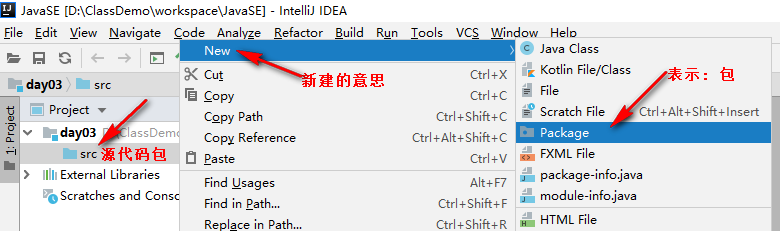

### 今日内容

* IDEA的安装以及基本使用(掌握)
* Random的基本使用
* 数组的介绍
* jvm中内存的划分,以及数组在内存中画图
* 数组常见的操作
* 数组的练习

### 今日目标

* 独立安装IDEA,并且创建空项目, 在空项目中创建模块, 在模块中创建包, 在包中创建类
* 掌握Random随机[m,n]之间随机数
* 能够创建数组, 存取数组中的元素, 遍历数组
* 理解数组在内存中体现
* 独立完成数组相关练习

### 1. 开发工具

#### 1.1 概述

开发工具指的就是我们用来编写代码的软件, 常用的主要有以下几类: 

* windows操作系统自带的记事本

  > 缺点: 没有行号, 关键字不能高亮显示, 代码不能折叠.

* 高级记事本(Notepad++, Editplus)

  > 优点: 有行号, 关键字能高亮显示, 代码能折叠.
  >
  > 缺点: 不方便我们调试, 不适合开发大型项目.

* 集成开发工具(IDE: Integrated Development Environment)

  * 集成开发工具指的是**集代码的编写, 编译, 运行, 调试, 重构等一系列功能于一体**的软件.
  * 常用的`IDE`如下:
    * Eclipse
    * MyEclipse
    * IDEA

#### 1.2 IDEA的下载和安装

#####  概述

IDEA 全称 IntelliJ IDEA，是Java编程语言开发的集成环境。IntelliJ在业界被公认为最好的java开发工具，尤其在智能代码助手、代码自动提示、重构、J2EE支持、各类版本工具(git、svn等)、JUnit、CVS整合、代码分析、 创新的GUI设计等方面的功能可以说是超常的。IDEA是`JetBrains公司`的产品，这家公司总部位于`捷克共和国的首都布拉格`，开发人员以严谨著称的东欧程序员为主。它的旗舰版本还支持HTML，CSS，PHP，MySQL，Python等。免费版只支持Python等少数语言。

> 总结: IDEA这个软件是用ava语言开发的, 所以想使用IDEA, 你电脑上必须安装JRE. 

##### 5.2.2 下载

JetBrains公司官网: www.jetbrains.com

直接下载地址: www.jetbrains.com/idea/download/other.html

##### 5.2.3 安装

1. 双击安装包`ideaIU-2018.3.4.exe`进行安装, 选择`next`进行下一步.

   

2. 修改`安装路径`, 然后选择`next`.

   

3. 选择`64bit(64位)`, 然后选择`next`.

   

4. 直接选择`next`, 然后开始安装即可(这个过程需要点时间, 请耐心等待).

   

5. 安装成功.


#### 1.3 首次启动

1. 不导入任何配置, 选择`Do not import settings`, 然后选择`OK`.

   

2. 设置用户界面主题, 可以根据自己的喜好进行设置, 然后选择`Next: Default plugins`.

   

3. 这个界面是告诉我们, 当前的IDEA可以开发哪些程序, 默认这些模块都是选中的, 如果明确知道不需要使用某些模块, 可以通过`Disable All`禁用掉此模块. 这里我们不需要禁用, 直接选择`Next: Featured plugins`即可.

   

4. 这个界面是`JetBrains公司`提供给我们的`可选择性安装`的5个小插件, 我们可以根据需求进行选择, 这里建议安装最后一个插件`IDE Features Trainer`, 它可以帮助我们快速使用IDEA. 然后选择`Start using IntelliJ IDEA`即可.

   

5. 因为IDEA的旗舰版是`收费的`, 这里我们选择`Evaluate for free(免费试用30天)`.

   

#### 1.4 创建项目和模块

1. IDEA版项目组成简介.

   > 简单理解: 一个Java程序 = 一个IDEA中创建的项目.

   

   **详细图解**

   

2. 选择`Create New Project`, 新建项目.

   

3. 新建一个`空项目`.

   

4. 指定项目名和项目的保存位置.

   

5. 新建模块.

   

6. 第一次使用`IDEA`, 需要`关联JDK`.

   

7. 创建`Java模块`.

   

8. 指定模块名和路径, 然后选择`Finish`.

   

9. 第一次创建模块时, 如果模块没有自动关联JDK, 则需要我们手动设置下关联.

   

10. 设好以后, 格式如下, 至此, 模块创建完毕.

   

11. 第一次进入到`项目界面`, 会弹出如下对话框. 

    

#### 1.5 HelloWorld案例(IDEA版)

1. 在`src`源代码包下创建`自定义包 com.itheima.demo01`

   


   

2. 在`com.itheima.demo01`包下创建`HelloWorld`类.

   


   

3. 编写源代码, 然后在`代码编辑区`右键, 选择`Run HelloWorld.main()`, 执行程序即可.

   

4. 如果提示`错误: 找不到或无法加载主类 com.itheima.demo01.HelloWorld`, 则修改下`项目语言级别`即可, 然后重启下`IDEA`.

   > 具体步骤: 
   >
   > 左上角的`File` -> `Project Structure` -> `Project` -> 修改`Project SDK和Project language level`两个选项的值 -> 然后关闭`IDEA`软件, 重新打开即可.
   >
   > 图解:
   >
   > 
   >
   > 
   >
   > 

5. 目录解释. 

   

#### 1.6 基本配置和常用快捷键

##### 1.6.1 基本配置, 详见下图: 


​	**注意:**

​		隐藏不需要的文件, 需要在界面的`lgnore files and folders`选项值后加`*.idea;*.iml;out;`即可.


##### 1.6.2 IDEA常用快捷键

常用的快捷键如下图:

​	


#### 1.7 导入和删除模块

##### 1.7.1 删除项目

选择`要移除的项目`, 然后`右键点击`, 选择`Remove Module`, 即可移除该模块.


##### 1.7.2 导入模块.

选择IDEA软件左上角的`File选项`, 然后选择`Project Structured`, 选择`Modules`, 选择`+(加号)`, 然后选择`Import Module`, 然后导入指定模块即可.


### 2. 练习

#### 2.1 练习1

**需求**

* 小明左、右手中分别拿两张纸牌（比如：黑桃10和红桃8，数字10和8可通过键盘录入），

* 要求编写代码交换小明手中的牌.

**运行效果**

```java
请输入小明左手中的纸牌：
10
请输入小明右手中的纸牌：
8

互换前小明手中的纸牌：
左手中的纸牌：10
右手中的纸牌：8

互换后小明手中的纸牌：
左手中的纸牌：8
右手中的纸牌：10
```

**实现步骤**

1. 创建键盘录入对象
2. 定义int类型的变量left和right，并通过nextInt()方法给left和right赋值
3. 定义临时变量temp实现left和right变量值得交换
4. 按格式打印交换后的结果

**参考代码**

```java
import java.util.Scanner;

//定义一个类, 类名叫: ExerciseDemo01
public class ExerciseDemo01 {
    //定义main方法, 作为程序的主入口.
    public static void main(String[] args) {
        //1. 创建Scanner对象, 用于接收用户录入的数据.
        Scanner sc = new Scanner(System.in);
        //2. 提示用户录入小明左手中的纸牌点数, 并接收.
        System.out.println("请输入小明左手中的纸牌：");
        int left = sc.nextInt();
        //3. 提示用户录入小明右手中的纸牌点数, 并接收.
        System.out.println("请输入小明右手中的纸牌：");
        int right = sc.nextInt();
        //4. 打印交换前的结果.
        System.out.println();
        System.out.println("互换前小明手中的纸牌：");
        System.out.println("左手中的纸牌：" + left);
        System.out.println("右手中的纸牌：" + right);

        //5. 通过定义临时变量temp, 交换小明左右手中的牌.
        int temp = left;
        left = right;
        right = temp;

        //6. 打印交换前的结果.
        System.out.println();
        System.out.println("互换后小明手中的纸牌：");
        System.out.println("左手中的纸牌：" + left);
        System.out.println("右手中的纸牌：" + right);
    }
}
```


#### 2.2 练习2

**需求**

* 提示用户键盘录入一个三位数, 并接收.
* 求这个数的个位,十位,百位分别是多少.
* 并将结果打印到控制台上.

**参考代码**

```java
import java.util.Scanner;

//定义一个类, 类名叫: ExerciseDemo02
public class ExerciseDemo02 {
    //定义main方法, 作为程序的主入口.
    public static void main(String[] args) {
        //1. 创建Scanner对象, 用户接受用户录入的数据.
        Scanner sc = new Scanner(System.in);
        //2. 提示用户录入一个三位数, 并接收.
        System.out.println("请录入一个100 - 999 之间的整数: ");
        int num = sc.nextInt();
        //3. 获取该三位数的各个位数上的数字.
        int ge = num % 10;
        int shi = num / 10 % 10;
        int bai = num / 100 % 10;
        //4. 打印结果.
        System.out.println(num + "的百位数字是: " + bai + ", 十位数字是: " + shi + ", 个位数字是: " + ge);
    }
}
```


#### 2.3 练习3

**需求**

键盘录入一个三位数字,输出该三位数字是否是水仙花数字?

> 提示:
>
> 1. 水仙花数是一个三位数字.
> 2. 该数字的各个位数的立方和等于该数字本身.
> 3. 例如: 153 = 1 * 1 * 1 + 5 * 5 * 5 + 3 * 3 * 3 = 27 + 125 + 1 = 153

**思路分析**

1. 创建键盘录入对象
2. 获取一个int数字
3. 获取个位,十位,百位
4. 求个位,十位,百位的立方和
5. 利用三元运算符求立方和是否等于该数字本身
6. 打印结果

**参考代码**

```java
import java.util.Scanner;

//定义一个类, 类名叫: ExerciseDemo03
public class ExerciseDemo03 {
    //定义main方法, 作为程序的主入口.
    public static void main(String[] args) {
        //1. 创建Scanner对象, 用户接受用户录入的数据.
        Scanner sc = new Scanner(System.in);
        //2. 提示用户录入一个三位数, 并接收.
        System.out.println("请录入一个100 - 999 之间的整数: ");
        int num = sc.nextInt();
        //3. 获取该三位数的各个位数上的数字.
        int ge = num % 10;
        int shi = num / 10 % 10;
        int bai = num / 100 % 10;
        //4. 判断数字num是否是水仙花数.
        String result = (num == ge * ge * ge + shi * shi * shi + bai * bai * bai) ? "是水仙花数" : "不是水仙花数";
        //5. 打印结果
        System.out.println(num + result);
    }
}
```

### 3. 生成随机数

#### 3.1 概述

Random类似Scanner，也是Java提供好的API(Application Programming Interface)，内部提供了产生随机数的功能. API后续课程详细讲解，现在可以简单理解为Java已经写好的代码, 我们可以直接拿来用.

#### 3.2 使用步骤

1. 导入包

   ```java
   import java.util.Random;
   ```

2. 创建随机数Random对象.

   ```java
   Random r = new Random();
   ```

3. 调用方法, 产生随机数

   ```java
   int num = r.nextInt(10);	//小括号中可以传入任意的正整数
   ```

   >  解释： 
   >
   >  1. 小括号中写的整数是生成的随机数的上限.
   >  2. 例如: 小括号中写10 , 说明生成0~10之间的随机数, 包含0, 但是不包含10, 即: 包左不包右.
   >  3. 小括号中必须传入正整数, 否则会报`IllegalArgumentException(非法参数异常)`.

#### 3.3 案例一: Random入门

**需求**

使用Random类，生成5个10以内的随机整数, 并将结果打印到控制台.

**参考代码**

```java
import java.util.Random;

public class RandomDemo01 {
    public static void main(String[] args) {
        //1. 创建Random对象.
        Random r = new Random();
        //2. 定义for循环, 用来获取3个随机数.
        int num;
        for (int i = 1; i <= 3; i++) {
            //3. 调用r.nextInt(数字)方法, 获取具体的随机数.
            num = r.nextInt(10);
            System.out.println(num);
        }
    }
}
```


#### 3.4 案例二: 随机职业

**需求**

1. 提示用户录入他/她的名字并接收.
2. 通过随机数, 来打印用户上辈子的职业. 
3. 0: 宰相, 1: 一品带刀侍卫, 2:皇帝, 3: 大内总管, 4: 店小二, 5: 江湖郎中

**参考代码**

```java
import java.util.Random;
import java.util.Scanner;

public class RandomDemo03 {
    public static void main(String[] args) {
        /*
            1. 提示用户录入他/她的名字并接收.
            2. 通过随机数, 来打印用户上辈子的职业.
            3. 0: 宰相, 1: 一品带刀侍卫, 2:皇帝, 3: 大内总管, 4: 店小二, 5: 江湖郎中
         */
        //1. 创建Random类的对象.
        Random r = new Random();
        //2. 提示用户录入他/她的名字并接收.
        Scanner sc = new Scanner(System.in);
        System.out.println("请录入您的姓名, 我来算一下您上辈子的职业: ");
        String name = sc.nextLine();

        //3. 生成一个0-5之间的随机数.
        int num = r.nextInt(6);
        String occupation = "";
        switch (num) {
            case 0:
                occupation = "宰相";
                break;
            case 1:
                occupation = "一品带刀侍卫";
                break;
            case 2:
                occupation = "皇帝";
                break;
            case 3:
                occupation = "大内总管";
                break;
            case 4:
                occupation = "店小二";
                break;
            case 5:
                occupation = "宰相";
                break;
            default:
                System.out.println("江湖郎中");
                break;
        }
        //4. 根据生成的随机数, 打印用户上辈子的职业.
        System.out.println("您好, " + name + ", 经过大数据分析, 您上辈子的职业是: " + occupation);
    }
}
```


#### 3.5 案例三: 猜数字

**需求**

1. 生成一个1-100之间的随机数, 让用户来猜. 
2. 如果猜的数字比生成的随机数大，提示你猜的数据大了
3. 如果猜的数字比生成的随机数小，提示你猜的数据小了
4. 如果猜的数字与生成的随机数相等，提示恭喜你猜中了

**参考代码**

```java
import java.util.Random;
import java.util.Scanner;

public class RandomDemo02 {
    public static void main(String[] args) {
        //1. 创建Random类的对象.
        Random r = new Random();
        //2. 生成一个随机数让用户来猜.
        int guessNum = r.nextInt(100) + 1;
        //3. 因为不知道用户多少次能猜对, 所以用while(true)死循环.
        int inputNum = 0;
        while (true) {
            //4. 提示用户录入猜的数据, 并接收.
            System.out.println("请录入您猜的数据(1-100): ");
            inputNum = new Scanner(System.in).nextInt();
            //5. 比较用户录入的数据 和 生成的随机数是否一致, 并提示.
            if (inputNum > guessNum)
                System.out.println("您猜的数字大了!");
            else if (inputNum < guessNum)
                System.out.println("您猜的数字小了");
            else {
                System.out.println("恭喜您, 猜对了, 请找班任领取奖品... 就业班晋级卡");
                break;
            }
        }
    }
}
```

---

### 4. 数组简介  

#### 4.1 概述

我们之前学习的变量或者是常量, 只能用来存储一个数据, 例如: 存储一个整数, 小数或者字符串等. 如果需要同时存储多个同类型的数据, 用变量或者常量来实现的话, 非常的繁琐. 针对于这种情况, 我们就可以通过**数组**来实现了.

例如: 假设某公司有50名员工, 现在需要统计该公司员工的工资情况, 例如计算平均工资、获取最高工资等。针对于这个需求，如果用前面所学的知识实现，程序首先需要声明50个变量来分别记住每位员工的工资，然后在进行操作，这样做非常繁琐，而且错误率也会很高。因此我们可以使用容器进行操作。将所有的数据全部存储到一个容器中，统一操作。**数组, 就是一种容器**.

> 解释:
>
> 1. 容器: 就是将多个数据存储到一起, 每个数据都是该容器的元素.
> 2. 现实生活中的容器: 水杯, 衣柜, 教室等...

**数组概述**

数组就是用来存储多个同类型元素的容器, 例如: 存储5个整数, 或者存储10个小数, 亦或者存储3个字符串等...


#### 4.2 格式

* 动态初始化: 我们给定长度, 由系统给出默认初始化值.

  ```java
  //格式一(推荐)
  数据类型[] 数组名 = new 数据类型[长度];
  
  //格式二(不推荐)
  数据类型 数组名[] = new 数据类型[长度];
  ```

  > 解释: 上述两种定义方式只是写法不同, 并无其他区别. 

* 静态初始化: 我们给定初始化值, 由系统指定长度. 

  ```java
  //格式一
  数据类型[] 数组名 = new 数据类型[]{元素1, 元素2, 元素3};		//这里可以有多个元素.
  
  //格式二 语法糖.
  数据类型[] 数组名 = {元素1, 元素2, 元素3};
  ```

  > 解释: 上述两种定义方式只是写法不同, 并无其他区别. 


#### 4.3 示例: 定义数组

**需求**

1. 创建int类型的数组, 用来存储3个元素.
2. 创建int类型的数组, 存储数据`11, 22, 33`.

**参考代码**

```java
public class ArrayDemo01 {
    public static void main(String[] args) {
        //1. 创建int类型的数组, 用来存储3个元素.
        //我们制定长度, 由系统给出默认值.
        //格式一:
        int[] arr1 = new int[3];		//推荐.
        //格式二:
        int arr2[] = new int[3];

        //2. 创建int类型的数组, 存储数据`11, 22, 33`.
        //我们直接传入元素, 由系统指定长度.
        //格式1
        int[] arr3 = new int[]{11, 22, 33};
        //格式2
        int[] arr4 = {11, 22, 33};		//推荐.
    }
}
```


#### 4.4 数组各部分解释

**此处以动态初始化举例:**

```java
数据类型[] 数组名 = new 数据类型[长度];

//例如:
int[] arr = new int[3];
```

**解释:**

* 数据类型: 指的是数组中存储元素的数据类型

  > 例如: 如果是int, 说明数组中只能存储int类型的数据, 如果是String, 则说明数组中只能存储字符串.

* []: 表示是一个数组.

* 数组名: 类似于之前定义的变量名, 要符合命名规范, 我们可以通过`数组名`来操作数组.

* new: 它是一个关键字, 表示用来创建数组对象的. 

* [长度]: 表示数组中最多能存储几个元素.


#### 4.5 数组的特点及基本用法

##### 4.5.1 特点

1. 数组中的每个元素都是有编号的, 且编号是从0开始的. 可以方便我们快速操作数组中的元素. 

   > 解释: 编号也叫索引(这个是最常见的念法), 下标, 角标. 

2. 数组中每个元素都有默认值. 

   > 例如:
   >
   > 1. int类型数组, 元素默认值是: 0
   > 2. double类型的数组, 元素默认值是: 0.0
   > 3. boolean类型的数组, 元素默认值是: false
   > 4. String类型的数组, 元素默认值是: null


##### 4.5.2 基本用法

1. 通过`数组名[索引]`的形式, 可以快速获取数组中的指定元素.

   ```java
   //格式
   数组名[索引]
   
   //例如:
   int[] arr = {11, 22, 33};
   System.out.println(arr[0]);	//打印结果是: 11
   System.out.println(arr[2]);	//打印结果是: 33
   ```

2. 通过`数组名[索引] = 值;`的方式, 可以修改数组中的指定元素值. 

   ```java
   //格式
   数组名[索引] = 值;
   
   //例如:
   int[] arr = {11, 22, 33};
   System.out.println(arr[1]);	//打印结果是: 22
   arr[1] = 222;
   System.out.println(arr[1]);	//打印结果是: 222
   // 将0号元素修改成1000
   arr[0] = 1000;
   System.out.println(arr[0]);	
   ```

3. 通过`数组名.length`的方式, 可以获取数组的长度.

   ```java
   //格式
   数组名.length
   
   //例如:
   int[] arr = {11, 22, 33};
   System.out.println(arr.length);	//打印结果是: 3
   ```

##### 4.5.3 示例: 数组的基本用法

**需求**

1. 定义一个长度为5的int类型的数组.
2. 打印数组中的第3个元素.
3. 设置数组中的第一个元素值为11.
4. 获取数组中的第一个元素值, 并将其赋值给变量a, 然后打印.
5. 打印数组的长度. 

**参考代码**

```java
public class ArrayDemo02 {
    public static void main(String[] args) {
        //1. 定义一个长度为5的int类型的数组.
        int[] arr = new int[5];
        //2. 打印数组中的第3个元素.
        System.out.println(arr[2]);
        //3. 设置数组中的第一个元素值为11.
        arr[0] = 11;
        //4. 获取数组中的第一个元素值, 并将其赋值给变量a, 然后打印.
        int a = arr[0];
        System.out.println(a);
        //5. 打印数组的长度.
        System.out.println(arr.length);
    }
}
```


### 5. 数组的内存图

#### 5.1 内存解释

内存是计算机中的重要原件，也是临时存储区域，作用是运行程序。我们编写的程序是存放在硬盘中的，在硬盘中的程序是不会运行的，必须放进内存中才能运行，运行完毕后会清空内存。

即: Java虚拟机要运行程序，必须要对内存进行空间的分配和管理。为了提高运算效率，就对空间进行了不同区域的划分，因为每一片区域都有特定的处理数据方式和内存管理方式。

**JVM的内存划分**

1. 栈: 存储局部变量以及所有代码执行的. 

   > 局部变量: 指的是定义在方法中, 或者方法声明上的变量. 
   >
   > 特点: 先进后出. 

2. 堆: 存储所有new出来的内容(即: 对象).

   > 特点: 堆中的内容会在不确定的时间, 被GC回收. 
   >
   > 堆内存的内容都有默认值

3. 方法区: 存储字节码文件的.

   > 字节码文件: 指的是后缀名为.class的文件. 

4. 本地方法区:

   > 和系统相关, 今天不做讲解. 

5. 寄存器

   > 和CPU相关, 今天不做讲解. 


#### 5.2 案例一: 一个数组内存图

查看如下代码:

```java
public class ArrayDemo03 {
    public static void main(String[] args) {
        int[] arr = new int[3];
        System.out.println(arr[0]);	//打印数组中的第一个元素, 值为: 0
        System.out.println(arr);    //[I@1540e19d
    }
}
```

其中**[I@1540e19d是arr数组的地址值**, 那这段代码在内存中的执行流程是怎样的呢? 我们一块儿来看下:

**图解**


#### 5.3 案例二: 两个数组内存图

**需求**

1. 定义一个长度为3的int类型的数组.
2. 修改数组中的第一个元素为: 11
3. 打印数组中的第一, 第二个元素.
4. 打印数组对象.
5. 定义一个int类型的数组, 存储元素1, 2.
6. 修改数组的第二个元素值为: 22.
7. 打印数组的第二个元素.
8. 打印数组对象.

**参考代码**

```java
public class ArrayDemo04 {
    public static void main(String[] args) {
        //1. 定义一个长度为3的int类型的数组.
        int[] arr1 = new int[3];
        //2. 修改数组中的第一个元素为: 11
        arr1[0] = 11;
        //3. 打印数组中的第一, 第二个元素.
        System.out.println(arr1[0]);
        System.out.println(arr1[1]);
        //4. 打印数组对象.
        System.out.println(arr1);
        //5. 定义一个int类型的数组, 存储元素1, 2.
        int[] arr2 = {1, 2};
        //6. 修改数组的第二个元素值为: 22.
        arr2[1] = 22;
        //7. 打印数组的第二个元素.
        System.out.println(arr2[1]);
        //8. 打印数组对象.
        System.out.println(arr2);
    }
}
```

上述代码的内存图解又是怎样的呢? 我们一块儿来看下:

**图解**


#### 5.4 案例三: 两个数组指向同一个对象

**需求**

1. 定义一个int类型的数组, 存储元素11, 22, 33.
2. 打印数组对象.
3. 打印数组中的各个元素值.
4. 定义第二个数组, 把第一个数组的地址值赋值给第二个数组.
5. 通过第二个数组, 修改第二个元素值为200.
6. 打印数组对象.
7. 打印数组中的各个元素值. 

**参考代码**.

```java
public class ArrayDemo05 {
    public static void main(String[] args) {
        //1. 定义一个int类型的数组, 存储元素11, 22, 33.
        int[] arr1 = {11, 22, 33};
        //2. 打印数组对象.
        System.out.println("arr1: " + arr1);
        //3. 打印数组中的各个元素值.
        System.out.println("arr1[0]: " + arr1[0]);
        System.out.println("arr1[1]: " + arr1[1]);
        System.out.println("arr1[2]: " + arr1[2]);
        //4. 定义第二个数组, 把第一个数组的地址值赋值给第二个数组.
        int[] arr2 = arr1;
        //5. 通过第二个数组, 修改第二个元素值为200.
        arr2[1] = 200;
        //6. 打印数组对象.
        System.out.println("arr2: " + arr2);
        //7. 打印数组中的各个元素值.
        System.out.println("arr2[0]: " + arr2[0]);
        System.out.println("arr2[1]: " + arr2[1]);
        System.out.println("arr2[2]: " + arr2[2]);
    }
}
```

上述代码的内存图解又是怎样的呢? 我们一块儿来看下:

**图解**


### 6. 数组的两个小问题

数组是我们在实际开发中用到的比较多的容器, 在使用它的时候, 很可能会遇到如下的两个问题:

1. 数组索引越界异常(ArrayIndexOutOfBoundsException)
2. 空指针异常(NullPointerException)

#### 6.1 数组索引越界异常

**产生原因**
访问了数组中不存在的索引. 

**解决方案**

访问数组中存在的索引即可.

**示例**

1. 定义int类型的数组, 存储元素11, 22.
2. 打印数组中的第2个元素. 
3. 尝试打印数组中的第3个元素.

**参考代码**

```java
public class ArrayDemo06 {
    public static void main(String[] args) {
        //1. 定义int类型的数组, 存储元素11, 22.
        int[] arr = {11, 22};
        //2. 打印数组中的第2个元素.
        System.out.println("arr[1]: " + arr[1]); //  22
        //3. 尝试打印数组中的第3个元素.
        System.out.println("arr[2]: " + arr[2]); //??? 出现索引越界异常
    }
}
```


#### 6.2 空指针异常

**产生原因**

访问了空对象. 即: 对象为空, 你还去调用它的一些方法, 肯定不行. 

**解决方案**

对对象赋具体的值即可.

**示例**

1. 定义int类型的数组, 存储元素11, 22.
2. 将null(空常量)赋值给数组.
3. 尝试打印数组的第一个元素. 

**参考代码**

```java
public class ArrayDemo07 {
    public static void main(String[] args) {
        //1. 定义int类型的数组, 存储元素11, 22.
        int[] arr = {11, 22};
        //2. 将null(空常量)赋值给数组.
        arr = null;
        //3. 尝试打印数组的第一个元素.
        System.out.println("arr[0]: " + arr[0]);
    }
}
```


### 7. 数组的常见操作

数组是我们在实际开发中用到的比较多的一种容器, 它的常见操作如下:

1. 遍历数组.
2. 获取数组的最值(最大值, 或者最小值).
3. 反转数组.


#### 7.1 案例一: 遍历数组

**需求**

1. 定义int类型的数组arr, 存储元素11, 22, 33, 44, 55.
2. 通过for循环, 遍历数组. 

**参考代码**

```java
public class ArrayDemo08 {
    public static void main(String[] args) {
        //1. 定义int类型的数组arr, 存储元素11, 22, 33, 44, 55.
        int[] arr = {11, 22, 33, 44, 55};
        //2. 通过for循环, 遍历数组. 
        for (int i = 0; i < arr.length; i++) {
            System.out.println(arr[i]);
        }
    }
}
```


#### 7.2 案例二: 获取数组的最大值

**需求**

已知各位美女的颜值如下图, 请求出下图中, 颜值最高的数字, 并打印到控制台上.

> 即:求数组int[] arr = {5, 15, 2000, 10000, 100, 4000};的最大值.


**参考代码**

```java
public class ArrayDemo09 {
    public static void main(String[] args) {
        //需求: 求数组int[] arr = {5, 15, 2000, 10000, 100, 4000};的最大值.
        int[] arr = {5, 15, 2000, 10000, 100, 4000};
        int max = arr[0];
        for (int i = 0; i < arr.length; i++) {
            if (max < arr[i])
                max = arr[i];
        }
        System.out.println("颜值最高的人的颜值为: " + max);
    }
}
```


#### 7.3 案例三: 反转数组

**需求**

1. 定义int类型的数组, 存储数据: 11, 33, 22, 55, 44.
2. 反转数组, 并打印反转后的结果. 

**参考代码**

```java
public class ArrayDemo10 {
    public static void main(String[] args) {
        //1. 定义数组.
        int[] arr = {11, 33, 22, 55, 44};
        //2. 反转数组.
        for (int i = 0; i < arr.length / 2; i++) {
            int temp = arr[i];
            arr[i] = arr[arr.length - 1 - i];
            arr[arr.length - 1 - i] = temp;
        }
        //3. 打印数组.
        for (int i = 0; i < arr.length; i++) {
            System.out.println(arr[i]);;
        }
    }
}
```


### 8. 数组相关练习题

#### 8.1 案例四: 评委打分

**需求**

1. 在编程竞赛中, 有6个评委为参赛的选手打分, 分数在0~100之间[
2. 选手的最后得分为: 去掉(一个最高分 + 去掉一个) , 然后和4取余即可.

**参考代码**

```jav
略.
```


#### 8.2 案例五:不死神兔

**需求**

已知序列1, 1, 2, 3, 5, 8, 13..., 求第12个数字是多少.

**参考代码**

```java
略. 
```


