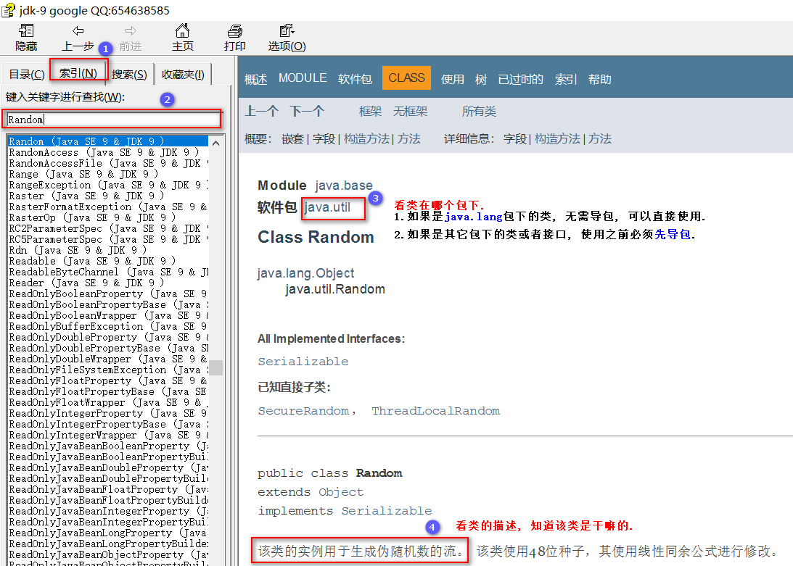

### 今日目标

- 理解API的相关概述
- 掌握API的用法
- 掌握Object类的toString(), equals()方法的用法
- 理解String类和StringBuilder类的相关概述
- 掌握String类和StringBuilder类中的常用方法

------

### 1. API简介

#### 1.1 概述

* API全称是`Application Programming Interface(应用程序编程接口)`. 例如:

  编写一个机器人程序去控制机器人踢足球，程序就需要向机器人发出向前跑、向后跑、射门、抢球等各种命令，机器人厂商一定会提供一些用于控制机器人的接口类，这些类中定义好了操作机器人各种动作的方法。其实，这些接口类就是机器人厂商提供给应用程序编程的接口，大家把这些类称为API。

* Java API: 指的就是JDK中提供的各种功能的Java类.

  这些类将底层的实现封装了起来, 我们不需要关心这些类是如何实现的, 只需要学习这些类如何使用即可. 

  我们可以通过**帮助文档**来学习这些API如何使用. 

> 记忆:
>
> 1. API本意指的是**JDK中提供的各种功能的Java类.**
> 2. 但实际开发中,  我们常说的**打开API**指的不是JDK提供的Java类, 而是**API 帮助文档**.
> 3. **API 帮助文档**就相当于说明书, **是用来介绍JDK提供的各个接口类的功能的, 从而帮助我们快速上手使用.**


#### 1.2 帮助文档的使用步骤

1. `右键`打开该文档.

   

2. 找到`索引`选项卡中的输入框.

   

3. 在输入框中输入要查找的类, 例如`Random`.

   

4. 看类在哪个包下. 如果是`java.lang`包下的类, 则无需导包, 可以直接使用.  

   而其他包下的类和接口, 在使用前必须先导包. 

   

5. 大概的看下类的说明, 知道该类是用来干嘛的即可.

   

6. 看构造方法, 根据指定的参数列表, 创建该类的对象. 

   

7. 看成员方法, 重点看(返回值, 方法名, 参数列表, 方法描述)


#### 1.3 示例: Scanner的用法

**需求**

按照帮助文档的使用步骤学习Scanner类的使用, 并实现键盘录入一个字符串, 然后把结果输出在控制台上.

**参考代码**

```java

```


### 2. Object类

#### 2.1 概述

Object类是所有类的父类, 所有的类都直接或者间接继承自Object类. 

#### 2.2 构造方法

```java
public Object()		//Object类中只有一个空参构造.
```

> 思考题: 回想咱们之前说过的一句话`为什么子类的构造方法的第一行, 默认都是super(), 而不是带参构造呢? `

#### 2.3 成员方法

* public String toString();

  > 解释: 返回对象的字符串表示形式(即: 地址值), 无意义, 建议子类重写该方法.  

* public boolean equals(Object obj);

  > 解释: 比较两个对象是否相等, 默认比较的是地址值, 无意义, 子类一般都会重写该方法. 
  >
  > 注意: 实际开发中, 我们认为**如果同一个类的两个对象, 各个属性值都相同, 那么它们就是同一个对象.**
  >
  > 例如:
  >
  > ```java
  > //虽然s1和s2对象的地址值不同, 但是它们的属性值都相同, 所以实际开发中我们认为它们是同一个对象.
  > Student s1 = new Student("刘亦菲", 33);
  > Student s2 = new Student("刘亦菲", 33);
  > ```

#### 2.4 示例一: toString方法演示

**需求**

1. 定义学生类Student, 属性为姓名和年龄, 生成对应的空参, 全参, getXxx()和setXxx()方法.
2. 在StudentTest测试类中, 创建学生类对象并直接打印, 观察程序的运行结果.

**参考代码** 

```java
略.
```


#### 2.5 示例二: equals()方法演示

**需求**

1. 定义学生类Student, 属性为姓名和年龄, 生成对应的空参, 全参, getXxx()和setXxx()方法.
2. 在StudentTest测试类中, 创建两个学生类对象, 属性值都是: 刘亦菲, 33
3. 并直接打印, 观察程序的运行结果.

**参考代码**

```java
略
```

> 记忆:  == 和 equals()方法的区别是什么? 


### 3. String类

#### 3.1 概述

String代表字符串类, 即: 由多个字符组成的一串数据. **字符串的本质就是一个字符数组. **

#### 3.2 构造方法

* public String()

  > 解释: 创建一个空白字符串对象, 不包含任何内容. 

* public String(String s)

  > 解释: 把字符串数据封装成字符串对象. 

* public String(char[] value)

  > 解释: 把字符数组的数据封装成字符串对象.

* public String(char[]  value, int index, int count)

  > 解释: 把字符数组的一部分数据封装成字符串对象.

* public String(byte[] bys)

  > 解释: 把字节数组的数据封装成字符串对象.

* public String(byte[] bys, int index, int count)

  > 解释: 把字节数组的一部分数据封装成字符串对象.

#### 3.3 示例一: 创建字符串对象

**需求**

1. 分别通过上述的三种方式创建字符串对象.

2. 在main方法中, 通过输出语句, 直接打印创建好的字符串对象.

   > 提示: 输出语句直接打印对象, 默认调用了对象的toString()方法.

**参考代码**

```java
略
```

> 记忆: 最常用的创建字符串对象的方法是: String s = "abc";


#### 3.4 String创建对象的特点

##### 3.4.1 创建字符串对象的方式

1. 通过`new`创建的字符串对象, 每一次new都会申请一个内存空间, 虽然内容相同, 但是地址值不同.

   ```java
   char[] chs = {'a', 'b', 'c'};
   String s1 = new String(chs);
   String s2 = new String(chs);	//这里的s1和s2的地址值肯定是不同的.
   ```

2. 通过`""`方式创建的字符串, 只要字符序列相同(顺序和大小写), 无论在程序代码中出现几次, JVM都只会创建一个String对象, 并在字符串池中维护. 

   ```java
   String s1 = "abc";
   String s2 = "abc";	//这两个对象在内存中其实是同一个对象. 
   ```


##### 3.4.2 示例

**需求**

1. 定义字符数组chs, 初始化值为: 'a, 'b', 'c', 这三个字符 .
2. 将其分别封装成s1, s2这两个字符串对象.
3. 通过`==`判断s1和s2这两个字符串对象是否相同.
4. 直接通过`""`的方式创建两个字符串对象s3和s4.
5. 通过`==`判断s3和s4这两个字符串对象是否相同.

**参考代码**

```java
略
```

**内存图解**

略


#### 3.5 字符串的比较

##### 3.5.1 涉及到的方法

- public boolean equals(Object obj)

  > 解释: 比较两个字符串的内容是否相同, **区分大小写**. 即: "a" 和 "A"不是同一个字符串. 

- public boolean equalsIgnoreCase(String s)

  > 解释: 比较两个字符串的内容是否相同, **不区分大小写**. 即: "a" 和 "A"是同一个字符串. 

##### 3.5.2 示例演示

**需求**

1. 定义字符数组chs, 初始化值为: 'a, 'b', 'c', 这三个字符 .
2. 将其分别封装成s1, s2这两个字符串对象.
3. 直接通过`""`的方式创建两个字符串对象s3和s4.
4. 通过`==`分别判断s1和s2, s1和s3, s3和s4是否相同.
5. 通过`equals()`分别判断s1和s2, s1和s3, s3和s4是否相同.
6. 通过`equalsIgnoreCase()`判断字符串abc和ABC是否相同. 

**参考代码**

```java
略
```


#### 3.6 示例二: 模拟用户登录

##### 3.6.1 需求

1. 模拟用户登录, 只给3次机会, 登录成功则提示"欢迎您, ***".
2. 登录失败则判断是否还有登录机会, 有则提示剩余登录次数, 没有则提示"您的账号已被锁定".
3. 假设初始化账号和密码分别为: "传智播客", "黑马程序员".

##### 3.6.2 参考代码

```java
略.
```


#### 3.7 示例三: 遍历字符串

**需求**

键盘录入一个字符串, 使用程序实现在控制台遍历打印该字符串.

**提示**

* public int length()

  > 解释: 获取字符串的长度. 

* public char charAt(int index)

  > 解释: 根据索引, 获取该索引对应的字符. 

**参考代码**

```java
略.
```


#### 3.8 示例四: 统计字符次数

**需求**

键盘录入一个字符串, 统计该字符串中`大写字母字符`, `小写字母字符`, `数字字符`出现的次数. 

> 注意: 不考虑其他字符, 例如`@, !, \, /等`

**参考代码**

```java
略.
```


#### 3.9 案例五: 字符串拼接

**需求**

1. 定义方法arrayToString(), 把int数组的元素按照指定的格式拼接成一个字符串, 并返回. 
2. 在main方法中, 调用上述的方法. 
3. 例如: 数组为int[] arr = {1, 2, 3}, 则拼接后, 结果为: [1, 2, 3]

**参考代码**

```java
略.
```


#### 3.10 案例六: 字符串反转

**需求**

1. 定义方法reverse(),  实现字符串的反转. 
2. 在main方法中键盘录入一个字符串, 调用上述的方法后, 在控制台输出结果.
3. 例如: 键盘录入abc, 输出结果cba.

> 提示: 用for循环, 倒序遍历数组, 然后拼接每一个元素即可. 

**参考代码**

```java
略.
```


#### 3.11 通过帮助文档查看String中的方法

* public boolean equals(Object obj)

  > 解释: 比较两个字符串的内容是否相同, 区分大小写.

* public char charAt(int index)

  > 解释: 根据给定的索引, 获取其对应的字符.

* public int length()

  > 解释: 获取字符串的长度. 
  
*  boolean contains(CharSequence s)  

  >解释:判断字符串中是否包含某个字符串

*  boolean endsWith(String suffix) 

  > 解释: 判断字符串是否以指定字符串结尾

* boolean startsWith(String prefix)  

  > 解释: 判断字符串是否以指定字符串开头

*  int indexOf(String str)

  > 解释: 获取指定字符串第一次出现的位置,从索引0开始往后找

* int indexOf(String str, int fromIndex) 

  > 解释: 获取指定字符串第一次出现的位置,从指定索引处开始往后找

* int lastIndexOf(String str) 

  > 解释: 获取指定字符串最后第一次出现的位置,从最后往前找

* String[] split(String regex) 

  > 解释: 讲字符串按照指定规则进行切割,将切割后的结果放到数组中返回

* String substring(int beginIndex) 

  > 解释: 从指定位置开始截取到字符串的末尾, 将截取后的结果返回

* String substring(int beginIndex, int endIndex) 

  > 解释: 从指定位置开始截取, 到指定位置结束, 包含头不包含,结果是[beginIndex,endIndex)之间的字符串

* String toLowerCase() 

  > 解释: 将字符串内容变小写返回

*  String toUpperCase() 

  > 解释:将字符串内容变大写返回

#### 3.12 String方法详解

##### contains

- 方法原型：public boolean contains (CharSequence s)

  #### CharSequence是一个接口，String类是它的实现类。

- 功能：判断参数字符串在当前字符串中是否存在(区分大小写)。存在，返回true，否则，返回false。

  ```java
  String s = "我爱Java，我爱学习！";
  System.out.println("字符串中是否包含Java：" + s.contains("Java"));//true
  System.out.println("字符串中是否包含java：" + s.contains("java"))//false
  
  ```


#####  endsWith

- 方法原型：public boolean endsWith(String suffix)

- 功能：测试此字符串是否以指定的后缀结尾(区分大小写)。

  ```java
  String name = "Test.java";
  System.out.println("判断name是否以java结尾：" + name.endsWith("java"));//true
  System.out.println("判断name是否以Java结尾：" + name.endsWith("Java"));//false
  ```


##### startsWith

- 方法原型：public boolean startsWith(String prefix)

- 功能：测试此字符串是否以指定的前缀开始(区分大小写)

  ```java
  String name = "我爱Java";
  System.out.println("字符串是否以‘我’开头：" + name.startsWith("我"));//true
  ```


##### indexOf

- 方法原型：public int indexOf(String str)

- 功能：返回指定子字符串第一次出现的字符串内的索引。如果不包含，则返回-1.

  ```java
  String str = "我爱Java，我爱学习！";
  System.out.println("在字符串中，Java第一次出现的位置：" + str.indexOf("Java"));//2
  System.out.println("在字符串中，java第一次出现的位置：" + str.indexOf("java"));//-1
  ```


#####  lastIndexOf

- 方法原型：public int lastIndexOf(String str)

- 功能：返回指定子字符串最后一次出现的字符串中的索引。 如果不包含，则返回-1.

  ```java
  String str = "我爱Java，我爱学习！";
  System.out.println("在字符串中，'我'最后一次出现的位置：" + str.lastIndexOf("我"));//7
  ```


##### replace

- 方法原型：public String replace(CharSequence target,CharSequence replacement)

- 功能：将与字面目标序列匹配的字符串的每个子字符串替换为指定的文字替换序列。 替换从字符串开始到结束，例如，在字符串“aaa”中用“b”替换“aa”将导致“ba”而不是“ab”。 

  ```java
  String str = "我爱吃红烧鲤鱼，我太想吃红烧鲤鱼了！";
  System.out.println("将'红烧鲤鱼'替换为'咸水鸡'：" + str.replace("红烧鲤鱼","咸水鸡"));
  System.out.println("原字符串：" + str);
  ```


#####  substring

- 方法原型：public String substring(int beginIndex)：将当前字符串从beginIndex开始截取到末尾。

- 方法原型：public String substring(int beginIndex, int endIndex)：将当前字符串从beginIndex开始截取到endIndex - 1处。

- 功能：截取字符串，并将截取后的字符串返回。原字符串不变。

  ```java
  String str = "我爱Java";
  System.out.println("截取'Java'：" + str.substring(2));//Java
  System.out.println("截取'我爱'：" + str.substring(0,2))//我爱
  ```


#####  toCharArray

- 方法原型：public char[] toCharArray()

- 功能：将当前字符串转换为char[]数组。

  ```java
  String str = "身无彩凤双飞翼";
  char[] chArray = str.toCharArray();
  System.out.println(chArray);
  ```


#####  toLowerCase

- 方法原型： public String toLowerCase()

- 功能：将当前字符串中的所有英文字符转换为小写，并返回一个转换后的新字符串，原字符串不变。

  ```java
  String str = "我爱Java";
  System.out.println("转换为小写：" + str.toLowerCase());//我爱java
  System.out.println("原字符串：" + str);//我爱Java
  ```


#####  toUpperCase

- 方法原型：public String toUpperCase()

- 功能：将当前字符串中的所有英文字符转换为大写，并返回一个转换后的新字符串，原字符串不变。

  ```java
  String str = "我爱Java";
  System.out.println("转换为大写：" + str.toUpperCase());//我爱JAVA
  System.out.println("原字符串：" + str);//我爱Java
  ```


#####  trim

- 方法原型：public String trim()

- 功能：去掉当前字符串的前后空格，并返回一个新字符串，原字符串不变。

  ```java
  String str = "  ad  min     ";
  System.out.println("去掉前后空格后|" + str.trim() + "|");//去掉前后空格后|ad  min|
  System.out.println("原字符串|" + str + "|");//原字符串|  ad  min     |
  ```


#####  split

- 方法原型：public String[] split(String regex)

- 功能：切割字符串——将字符串以regex作为分隔符进行切割。

  ```java
  String str = "张三,20,男,13513153355";
  String[] arr = str.split(",");
  for(int i = 0;i < arr.length ; i++){
      System.out.println(arr[i]);
  }
  ```

  说明：此方法的参数实际上是一个"正则表达式"，功能很强大，后边学到正则表达式时会再次看到此方法。


### 4. StringBuilder类

分析如下代码, 执行效率是高还是低呢?

```java
String s = "hello";
s += "world";	
System.out.println(s);
```

> 解释:
>
> 如果字符串进行拼接操作, 每次拼接, 都会构建一个新的String对象, 即耗时, 	又浪费内存空间. 而这种操作还不可避免,.那有没有一种比较好的方式来解决这个问题呢? 
>
> 答案是肯定的, 我们可以通过Java提供的**StringBuilder类**来解决这个问题. 

#### 4.1 概述

* StringBuilder类在`java.lang`包下, 无需导包, 可以直接使用. 
* StringBuilder是一个可变的字符序列, 也叫**字符串缓冲区类**.
* 我们可以把它看做一个容器, 这里的可变指的是**StringBuilder对象中的内容是可变的**

**String和StringBuilder之间的区别**

* String: 内容是不可变的. 
* StringBuilder: 内容是可变的. 

#### 4.2 构造方法

* public StringBuilder()

  > 解释: 创建一个空白可变字符串对象, 它不含有任何内容.

* public StringBuilder(String str)

  > 解释: 根据字符串的内容, 来创建可变字符串对象.

#### 4.3 示例一: StringBuilder入门

**需求**

1. 通过上述的两种方式, 创建StringBuilder对象. 
2. 在控制台直接打印上述创建好的两个对象, 并观察结果.

**参考代码**

```java
略
```


#### 4.4 添加和反转方法

* public StringBuilder append(任意类型)

  > 解释: 添加数据, 并返回对象本身.

* public StringBuilder reverse()

  > 解释: 返回相反的字符序列.

**需求**

1. 通过空参构造创建StringBuilder类的对象sb.
2. 通过append()方法, 往sb对象中添加"hello",然后用sb2对象接收.
3. 打印对象sb和sb2的结果, 并观察. 
4. 通过`reverse()`方法, 来反转上述的内容.

**参考代码**

```java
略.
```


#### 4.5 StringBuilder和String之间的相互转换

* StringBuilder转化成String

  > 解释: 可以通过StringBuilder#toString()方法直接实现. 

* String转成StringBuilder

  > 解释: 通过StringBuilder类的构造方法实现, `public StringBuilder(String s)

**需求**

1. 定义空参不可变StringBuilder对象, 往里边添加完"hello"字符串后, 再将其转成String类型的对象.
2. 将String字符串转成StringBuilder对象, 然后打印.

**代码演示**

```java
略
```


#### 4.6 案例二: 拼接字符串升级版

**需求**

1. 定义方法arrayToString(), 把int数组的元素按照指定的格式拼接成一个字符串, 并返回. 
2. 在main方法中, 调用上述的方法. 
3. 例如: 数组为int[] arr = {1, 2, 3}, 则拼接后, 结果为: [1, 2, 3]

**参考代码**

```java
略.
```


#### 4.7 案例三: 字符串反转

**需求**

1. 定义方法reverse(),  实现字符串的反转. 
2. 在main方法中键盘录入一个字符串, 调用上述的方法后, 在控制台输出结果.
3. 例如: 键盘录入abc, 输出结果cba.

> 提示: 用for循环, 倒序遍历数组, 然后拼接每一个元素即可. 

**参考代码**

```java
略.
```


#### 4.8 通过帮助文档查看StringBuilder中的方法

* public StringBuilder append(任意类型)

  > 解释: 添加数据, 并返回对象本身.

* public StringBuilder reverse()

  > 解释: 返回相反的字符序列.

* public String toString()

  > 解释: 用来将StringBuilder对象, 转成其对应的字符串形式的. 

