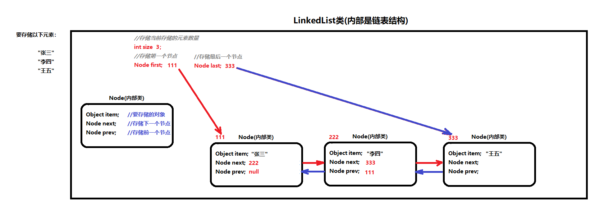

# day12【Collection、泛型、数据结构,List】

## 今日内容

- Collection集合
- 迭代器
- 泛型
- 数据结构
- List集合

## 教学目标

- [ ] 能够说出集合与数组的区别
- [ ] 能够使用Collection集合的常用功能
- [ ] 能够使用迭代器对集合进行取元素
- [ ] 能够使用增强for循环遍历集合和数组
- [ ] 能够理解泛型上下限
- [ ] 能够阐述泛型通配符的作用
- [ ] 能够说出常见的数据结构
- [ ] 能够说出数组结构特点
- [ ] 能够说出栈结构特点
- [ ] 能够说出队列结构特点
- [ ] 能够说出单向链表结构特点
- [ ] 能够熟练使用ArrayList
- [ ] 能够熟练使用LinkedList

# 第一章 Collection集合

## 1.1 集合概述

在前面基础班我们已经学习过并使用过集合ArrayList<E> ,那么集合到底是什么呢?

- **集合**：集合是java中提供的一种容器，可以用来存储多个数据。

集合和数组既然都是容器，它们有什么区别呢？

- 数组的长度是固定的。集合的长度是可变的。

- 数组中存储的是同一类型的元素，可以存储任意类型数据。集合存储的都是引用数据类型。如果想存储基本类型数据需要存储对应的包装类型。

  


## 1.2  集合常用类的继承体系

Collection：单列集合类的根接口，用于存储一系列符合某种规则的元素，它有两个重要的子接口，分别是`java.util.List`和`java.util.Set`。其中，**`List`的特点是元素有序、元素可重复 ; `Set`的特点是元素不可重复**。`List`接口的主要实现类有`java.util.ArrayList`和`java.util.LinkedList`，`Set`接口的主要实现类有`java.util.HashSet`和`java.util.LinkedHashSet`。

从上面的描述可以看出JDK中提供了丰富的集合类库，为了便于初学者进行系统地学习，接下来通过一张图来描述集合常用类的继承体系


注意:这张图只是我们常用的集合有这些，不是说就只有这些集合。

集合本身是一个工具，它存放在java.util包中。在`Collection`接口定义着单列集合框架中最最共性的内容。


## 1.3 Collection 常用功能

Collection是所有单列集合的父接口，因此在Collection中定义了单列集合(List和Set)通用的一些方法，这些方法可用于操作所有的单列集合。方法如下：

- `public boolean add(E e)`：  把给定的对象添加到当前集合中 。
- `public void clear()` :清空集合中所有的元素。
- `public boolean remove(E e)`: 把给定的对象在当前集合中删除。
- `public boolean contains(Object obj)`: 判断当前集合中是否包含给定的对象。
- `public boolean isEmpty()`: 判断当前集合是否为空。
- `public int size()`: 返回集合中元素的个数。
- `public Object[] toArray()`: 把集合中的元素，存储到数组中

> tips: 有关Collection中的方法可不止上面这些，其他方法可以自行查看API学习。

```java
public class Demo02ListMethod {
    public static void main(String[] args) {
        method4();
    }

    public static void method4() {
        //创建集合
        List<String> list = new ArrayList<>();
        //添加元素
        list.add("jack");
        list.add("rose");
        list.add("tony");
        //打印集合
        System.out.println("替换前：" + list); //[jack, rose, tony]
        //调用set方法，使用 tom 替换掉原来索引为1的元素
        String str = list.set(1, "tom");
        System.out.println("替换后：" + list); //[jack, tom, tony]
        System.out.println("str:" + str); //rose
    }

    public static void method3() {
        //创建集合
        List<String> list = new ArrayList<>();
        //添加元素
        list.add("jack");
        list.add("rose");
        list.add("tony");
        //打印集合
        System.out.println("删除前：" + list); //[jack, rose, tony]
        //调用remove方法，删除索引为1的元素
        String str = list.remove(1);
        System.out.println("删除后：" + list); //[jack, tony]
        System.out.println("str:" + str); //rose
    }

    public static void method2() {
        //创建集合
        List<String> list = new ArrayList<>();
        //添加元素
        list.add("jack");
        list.add("rose");
        list.add("tony");
        //调用get方法，根据索引获取元素
        System.out.println(list.get(1));
    }


    public static void method1() {
        //创建集合
        List<String> list = new ArrayList<>();
        //添加元素
        list.add("jack");
        list.add("rose");
        list.add("tony");
        //打印集合
        System.out.println("list:" + list); //[jack, rose, tony]
        //向索引为1的位置插入元素。 lucy
        list.add(1, "lucy");
        //打印集合
        System.out.println("list:" + list); //[jack, lucy, rose, tony]

    }
}

```


# 第二章 Iterator迭代器

## 2.1 Iterator接口

在程序开发中，经常需要遍历集合中的所有元素。针对这种需求，JDK专门提供了一个接口`java.util.Iterator`。

想要遍历Collection集合，那么就要获取该集合迭代器完成迭代操作，下面介绍一下获取迭代器的方法：

- `public Iterator iterator()`: 获取集合对应的迭代器，用来遍历集合中的元素的。

下面介绍一下迭代的概念：

- **迭代**：即Collection集合元素的通用获取方式。在取元素之前先要判断集合中有没有元素，如果有，就把这个元素取出来，继续再判断，如果还有就再取出来。一直把集合中的所有元素全部取出。这种取出方式专业术语称为迭代。

Iterator接口的常用方法如下：

- `public E next()`:返回迭代的下一个元素。
- `public boolean hasNext()`:如果仍有元素可以迭代，则返回 true。

接下来我们通过案例学习如何使用Iterator迭代集合中元素：

```java
public class IteratorDemo {
  	public static void main(String[] args) {
        // 使用多态方式 创建对象
        Collection<String> coll = new ArrayList<String>();

        // 添加元素到集合
        coll.add("串串星人");
        coll.add("吐槽星人");
        coll.add("汪星人");
        //遍历
        //使用迭代器 遍历   每个集合对象都有自己的迭代器
        Iterator<String> it = coll.iterator();
        //  泛型指的是 迭代出 元素的数据类型
        while(it.hasNext()){ //判断是否有迭代元素
            String s = it.next();//获取迭代出的元素
            System.out.println(s);
        }
  	}
}
```

> tips: 
>
> 1. 在进行集合元素获取时，如果集合中已经没有元素了，还继续使用迭代器的next方法，将会抛出java.util.NoSuchElementException没有集合元素异常。
> 2. 在进行集合元素获取时，如果添加或移除集合中的元素 , 将无法继续迭代 , 将会抛出ConcurrentModificationException并发修改异常.


## 2.2 迭代器的实现原理

​        我们在之前案例已经完成了Iterator遍历集合的整个过程。当遍历集合时，首先通过调用t集合的iterator()方法获得迭代器对象，然后使用hashNext()方法判断集合中是否存在下一个元素，如果存在，则调用next()方法将元素取出，否则说明已到达了集合末尾，停止遍历元素。

​        Iterator迭代器对象在遍历集合时，内部采用指针的方式来跟踪集合中的元素。在调用Iterator的next方法之前，迭代器的索引位于第一个元素之前，不指向任何元素，当第一次调用迭代器的next方法后，迭代器的索引会向后移动一位，指向第一个元素并将该元素返回，当再次调用next方法时，迭代器的索引会指向第二个元素并将该元素返回，依此类推，直到hasNext方法返回false，表示到达了集合的末尾，终止对元素的遍历。


## 2.3 增强for

增强for循环(也称for each循环)是**JDK1.5**以后出来的一个高级for循环，专门用来遍历数组和集合的。它的内部原理其实是个Iterator迭代器，所以在遍历的过程中，不能对集合中的元素进行增删操作。

格式：

```java
for(元素的数据类型  变量 : Collection集合or数组){ 
  	//写操作代码
}
```

它用于遍历Collection和数组。通常只进行遍历元素，不要在遍历的过程中对集合元素进行增删操作。

代码演示

```java
public class NBForDemo1 {
    public static void main(String[] args) {
		int[] arr = {3,5,6,87};
       	//使用增强for遍历数组
		for(int a : arr){//a代表数组中的每个元素
			System.out.println(a);
		}
    	
    	Collection<String> coll = new ArrayList<String>();
    	coll.add("小河神");
    	coll.add("老河神");
    	coll.add("神婆");
    	
    	for(String s :coll){
    		System.out.println(s);
    	}
	}
}
```


> tips: 
>
> 增强for循环必须有被遍历的目标，目标只能是Collection或者是数组；
>
> 增强for（迭代器）仅仅作为遍历操作出现，不能对集合进行增删元素操作，否则抛出ConcurrentModificationException并发修改异常 


> 小结：Collection是所有单列集合的根接口，如果要对单列集合进行遍历，通用的遍历方式是迭代器遍历或增强for遍历。


# 第三章 泛型

## 3.1  泛型概述

在前面学习集合时，我们都知道集合中是可以存放任意对象的，只要把对象存储集合后，那么这时他们都会被提升成Object类型。当我们在取出每一个对象，并且进行相应的操作，这时必须采用类型转换。

大家观察下面代码：

```java
public class GenericDemo {
	public static void main(String[] args) {
		Collection coll = new ArrayList();
		coll.add("abc");
		coll.add("itcast");
		coll.add(5);//由于集合没有做任何限定，任何类型都可以向其中存放
		Iterator it = coll.iterator();
		while(it.hasNext()){
			//需要打印每个字符串的长度,就要把迭代出来的对象转成String类型
			String str = (String) it.next();
			System.out.println(str.length());
		}
	}
}
```

程序在运行时发生了问题**java.lang.ClassCastException**。                                                                                             为什么会发生类型转换异常呢？                                                                                                                                       我们来分析下：由于集合中什么类型的元素都可以存储。导致取出时强转引发运行时 ClassCastException。                                                                                                                                                       怎么来解决这个问题呢？                                                                                                                                                           Collection虽然可以存储各种对象，但实际上通常Collection只存储同一类型对象。例如都是存储字符串对象。因此在JDK5之后，新增了**泛型**(**Generic**)语法，让你在设计API时可以指定类或方法支持泛型，这样我们使用API的时候也变得更为简洁，并得到了编译时期的语法检查。

- **泛型**：可以在类或方法中预知地使用未知的类型。

> tips:泛型的作用是在创建对象时，将未知的类型确定具体的类型。当没有指定泛型时，默认类型为Object类型。


## 3.2  使用泛型的好处

上一节只是讲解了泛型的引入，那么泛型带来了哪些好处呢？

- 将运行时期的ClassCastException，转移到了编译时期变成了编译失败。
- 避免了类型强转的麻烦。

通过我们如下代码体验一下：

```java
public class GenericDemo2 {
	public static void main(String[] args) {
        Collection<String> list = new ArrayList<String>();
        list.add("itheima");
        list.add("itcast");
        // list.add(666);//当集合明确类型后，存放类型不一致就会编译报错
        // 集合已经明确具体存放的元素类型，那么在使用迭代器的时候，迭代器也同样会知道具体遍历元素类型
        Iterator<String> it = list.iterator();
        while(it.hasNext()){
            String str = it.next();
            //当使用Iterator<String>控制元素类型后，就不需要强转了。获取到的元素直接就是String类型
            System.out.println(str.length());
        }
	}
}
```

> tips:泛型是数据类型的一部分，我们将类名与泛型合并一起看做数据类型。


## 3.3  泛型的定义与使用

我们在集合中会大量使用到泛型，这里来完整地学习泛型知识。

泛型，用来灵活地将数据类型应用到不同的类、方法、接口当中。将数据类型作为参数进行传递。

### 定义和使用含有泛型的类

定义格式：

```
修饰符 class 类名<代表泛型的变量> {  }
```

例如，API中的ArrayList集合：

泛型在定义的时候不具体，使用的时候才变得具体。在使用的时候确定泛型的具体数据类型。

```java
class ArrayList<E>{ 
    public boolean add(E e){ }

    public E get(int index){ }
   	....
}
```

使用泛型： 即什么时候确定泛型。

**在创建对象的时候确定泛型**

 例如，`ArrayList<String> list = new ArrayList<String>();`

此时，变量E的值就是String类型,那么我们的类型就可以理解为：

```java 
class ArrayList<String>{ 
     public boolean add(String e){ }

     public String get(int index){  }
     ...
}
```

再例如，`ArrayList<Integer> list = new ArrayList<Integer>();`

此时，变量E的值就是Integer类型,那么我们的类型就可以理解为：

```java
class ArrayList<Integer> { 
     public boolean add(Integer e) { }

     public Integer get(int index) {  }
     ...
}
```

### 含有泛型的方法

定义格式：

```
修饰符 <代表泛型的变量> 返回值类型 方法名(参数){  }
```

例如，

```java
public class MyGenericMethod {	  
    public <MVP> void show(MVP mvp) {
    	System.out.println(mvp.getClass());
    }
    
    public <MVP> MVP show2(MVP mvp) {	
    	return mvp;
    }
}
```

**调用方法时，确定泛型的类型**

```java
public class GenericMethodDemo {
    public static void main(String[] args) {
        // 创建对象
        MyGenericMethod mm = new MyGenericMethod();
        // 演示看方法提示
        mm.show("aaa");
        mm.show(123);
        mm.show(12.45);
    }
}
```

### 含有泛型的接口

定义格式：

```
修饰符 interface接口名<代表泛型的变量> {  }
```

例如，

```java
public interface MyGenericInterface<E>{
	public abstract void add(E e);
	
	public abstract E getE();  
}
```

使用格式：

**1、定义类时确定泛型的类型**

例如

```java
public class MyImp1 implements MyGenericInterface<String> {
	@Override
    public void add(String e) {
        // 省略...
    }

	@Override
	public String getE() {
		return null;
	}
}
```

此时，泛型E的值就是String类型。

 **2、始终不确定泛型的类型，直到创建对象时，确定泛型的类型**

 例如

```java
public class MyImp2<E> implements MyGenericInterface<E> {
	@Override
	public void add(E e) {
       	 // 省略...
	}

	@Override
	public E getE() {
		return null;
	}
}
```

确定泛型：

```java
/*
 * 使用
 */
public class GenericInterface {
    public static void main(String[] args) {
        MyImp2<String>  my = new MyImp2<String>();  
        my.add("aa");
    }
}
```

> 小结：泛型是一种未知的数据类型，定义在类上的泛型，使用类的时候会确定泛型的类型，定义在方法上的泛型，会在使用方法的时候确定泛型，定义在接口上的泛型，需要使用接口的时候确定泛型。


## 3.4  泛型通配符(泛型的限定)

当使用泛型类或者接口时，传递的数据中，泛型类型不确定，可以通过通配符<?>表示。但是一旦使用泛型的通配符后，只能使用Object类中的共性方法，集合中元素自身方法无法使用。

#### 通配符基本使用

泛型的通配符:**不知道使用什么类型来接收的时候,此时可以使用?,?表示未知通配符。**

此时只能接受数据,不能往该集合中存储数据。

举个例子大家理解使用即可：

```java
public static void main(String[] args) {
    Collection<Intger> list1 = new ArrayList<Integer>();
    getElement(list1);
    Collection<String> list2 = new ArrayList<String>();
    getElement(list2);
}

public static void getElement(Collection<?> coll){}

//？代表可以接收任意类型
//泛型不存在继承关系 Collection<Object> list = new ArrayList<String>();这种是错误的。
```

#### 通配符高级使用----受限泛型

之前设置泛型的时候，实际上是可以任意设置的，只要是类就可以设置。但是在JAVA的泛型中可以指定一个泛型的**上限**和**下限**。

**泛型的上限**：

- **格式**： `类型名称 <? extends 类 > 对象名称`
- **意义**： `只能接收该类型及其子类`

**泛型的下限**：

- **格式**： `类型名称 <? super 类 > 对象名称`
- **意义**： `只能接收该类型及其父类型`

比如：现已知Object类，String 类，Number类，Integer类，其中Number是Integer的父类

```java
public static void main(String[] args) {
    Collection<Integer> list1 = new ArrayList<Integer>();
    Collection<String> list2 = new ArrayList<String>();
    Collection<Number> list3 = new ArrayList<Number>();
    Collection<Object> list4 = new ArrayList<Object>();
    
    getElement1(list1);
    getElement1(list2);//报错
    getElement1(list3);
    getElement1(list4);//报错
  
    getElement2(list1);//报错
    getElement2(list2);//报错
    getElement2(list3);
    getElement2(list4);
  
}
// 泛型的上限：此时的泛型?，必须是Number类型或者Number类型的子类
public static void getElement1(Collection<? extends Number> coll){}
// 泛型的下限：此时的泛型?，必须是Number类型或者Number类型的父类
public static void getElement2(Collection<? super Number> coll){}
```

> ?表示泛型通配符，如果要对?泛型通配符的取值范围进行限制，可以使用泛型限定


# 第四章 数据结构

## 4.1 数据结构介绍

数据结构 : 数据用什么样的方式组合在一起。


## 4.2 常见数据结构

数据存储的常用结构有：栈、队列、数组、链表。我们分别来了解一下：

#### 栈

- **栈**：**stack**,又称堆栈，它是运算受限的线性表，其限制是仅允许在标的一端进行插入和删除操作，不允许在其他任何位置进行添加、查找、删除等操作。

简单的说：采用该结构的集合，对元素的存取有如下的特点

- 先进后出（即，存进去的元素，要在后它后面的元素依次取出后，才能取出该元素）。例如，子弹压进弹夹，先压进去的子弹在下面，后压进去的子弹在上面，当开枪时，先弹出上面的子弹，然后才能弹出下面的子弹。

- 栈的入口、出口的都是栈的顶端位置。

  


这里两个名词需要注意：

- **压栈**：就是存元素。即，把元素存储到栈的顶端位置，栈中已有元素依次向栈底方向移动一个位置。
- **弹栈**：就是取元素。即，把栈的顶端位置元素取出，栈中已有元素依次向栈顶方向移动一个位置。

#### 队列

- **队列**：**queue**,简称队，它同堆栈一样，也是一种运算受限的线性表，其限制是仅允许在表的一端进行插入，而在表的另一端进行取出并删除。

  简单的说，采用该结构的集合，对元素的存取有如下的特点：

  - 先进先出（即，存进去的元素，要在后它前面的元素依次取出后，才能取出该元素）。例如，小火车过山洞，车头先进去，车尾后进去；车头先出来，车尾后出来。
  - 队列的入口、出口各占一侧。例如，下图中的左侧为入口，右侧为出口。


#### 数组

- **数组**:**Array**,是有序的元素序列，数组是在内存中开辟一段连续的空间，并在此空间存放元素。就像是一排出租屋，有100个房间，从001到100每个房间都有固定编号，通过编号就可以快速找到租房子的人。

简单的说,采用该结构的集合，对元素的存取有如下的特点：

- 查找元素快：通过索引，可以快速访问指定位置的元素

  

- 增删元素慢

- **指定索引位置增加元素**：需要创建一个新数组，将指定新元素存储在指定索引位置，再把原数组元素根据索引，复制到新数组对应索引的位置。如下图

- **指定索引位置删除元素：**需要创建一个新数组，把原数组元素根据索引，复制到新数组对应索引的位置，原数组中指定索引位置元素不复制到新数组中。如下图


#### 链表

- **链表**:**linked list**,由一系列结点node（链表中每一个元素称为结点）组成，结点可以在运行时动态生成。每个结点包括两个部分：一个是存储数据元素的数据域，另一个是存储下一个结点地址的指针域。我们常说的链表结构有单向链表与双向链表，那么这里给大家介绍的是**单向链表**。

  

  简单的说，采用该结构的集合，对元素的存取有如下的特点：

  - 多个结点之间，通过地址进行连接。例如，多个人手拉手，每个人使用自己的右手拉住下个人的左手，依次类推，这样多个人就连在一起了。

  - 查找元素慢：想查找某个元素，需要通过连接的节点，依次向后查找指定元素。

  - 增删元素快：

  


# 第五章 List接口

我们掌握了Collection接口的使用后，再来看看Collection接口中的子类，他们都具备那些特性呢？

接下来，我们一起学习Collection中的常用几个子类（`java.util.List`集合、`java.util.Set`集合）。

## 5.1 List接口介绍

`java.util.List`接口继承自`Collection`接口，是单列集合的一个重要分支，习惯性地会将实现了`List`接口的对象称为List集合。在List集合中允许出现重复的元素，所有的元素是以一种线性方式进行存储的，在程序中可以通过索引来访问集合中的指定元素。另外，List集合还有一个特点就是元素有序，即元素的存入顺序和取出顺序一致。

看完API，我们总结一下：

List接口特点：

1. 它是一个元素存取有序的集合。例如，存元素的顺序是11、22、33。那么集合中，元素的存储就是按照11、22、33的顺序完成的）。
2. 它是一个带有索引的集合，通过索引就可以精确的操作集合中的元素（与数组的索引是一个道理）。
3. 集合中可以有重复的元素，通过元素的equals方法，来比较是否为重复的元素。

> tips:我们在基础班的时候已经学习过List接口的子类java.util.ArrayList类，该类中的方法都是来自List中定义。


## 5.2 List接口中常用方法

List作为Collection集合的子接口，不但继承了Collection接口中的全部方法，而且还增加了一些根据元素索引来操作集合的特有方法，如下：

- `public void add(int index, E element)`: 将指定的元素，添加到该集合中的指定位置上。
- `public E get(int index)`:返回集合中指定位置的元素。
- `public E remove(int index)`: 移除列表中指定位置的元素, 返回的是被移除的元素。
- `public E set(int index, E element)`:用指定元素替换集合中指定位置的元素,返回值的更新前的元素。

List集合特有的方法都是跟索引相关，我们在基础班都学习过。

> tips:我们之前学习Colletion体系的时候，发现List集合下有很多集合，它们的存储结构不同，这样就导致了这些集合它们有各自的特点，供我们在不同的环境下使用，那么常见的数据结构有哪些呢？在下一章我们来介绍：


## 5.3 ArrayList集合

`java.util.ArrayList`集合数据存储的结构是数组结构。元素增删慢，查找快，由于日常开发中使用最多的功能为查询数据、遍历数据，所以`ArrayList`是最常用的集合。

许多程序员开发时非常随意地使用ArrayList完成任何需求，并不严谨，这种用法是不提倡的。


## 5.4 LinkedList集合

`java.util.LinkedList`集合数据存储的结构是链表结构。方便元素添加、删除的集合。

> LinkedList是一个双向链表，那么双向链表是什么样子的呢，我们用个图了解下


实际开发中对一个集合元素的添加与删除经常涉及到首尾操作，而LinkedList提供了大量首尾操作的方法。这些方法我们作为**了解即可**：

- `public void addFirst(E e)`:将指定元素插入此列表的开头。
- `public void addLast(E e)`:将指定元素添加到此列表的结尾。
- `public E getFirst()`:返回此列表的第一个元素。
- `public E getLast()`:返回此列表的最后一个元素。
- `public E removeFirst()`:移除并返回此列表的第一个元素。
- `public E removeLast()`:移除并返回此列表的最后一个元素。
- `public E pop()`:从此列表所表示的堆栈处弹出一个元素。
- `public void push(E e)`:将元素推入此列表所表示的堆栈。
- `public boolean isEmpty()`：如果列表不包含元素，则返回true。

LinkedList是List的子类，List中的方法LinkedList都是可以使用，这里就不做详细介绍，我们只需要了解LinkedList的特有方法即可。在开发时，LinkedList集合也可以作为堆栈，队列的结构使用。

```java
public class Demo04LinkedList {
	public static void main(String[] args) {
		method4();
	}
	/*
	 *  void push(E e)： 压入。把元素添加到集合的第一个位置。
	 *  E pop()： 弹出。把第一个元素删除，然后返回这个元素。
	 */
	public static void method4() {
		//创建LinkedList对象
		LinkedList<String> list = new LinkedList<>();
		//添加元素
		list.add("达尔文");
		list.add("达芬奇");
		list.add("达尔优");
		System.out.println("list:" + list);
		//调用push在集合的第一个位置添加元素
		//list.push("爱迪生");
		//System.out.println("list:" + list);//[爱迪生, 达尔文, 达芬奇, 达尔优]
		
		//E pop()： 弹出。把第一个元素删除，然后返回这个元素。
		String value = list.pop();
		System.out.println("value:" + value);//达尔文
		System.out.println("list:" + list);//[达芬奇，达尔优]
	}
	
	/*
	 * E removeFirst()：删除第一个元素
	 * E removeLast()：删除最后一个元素。
	 */
	public static void method3() {
		//创建LinkedList对象
		LinkedList<String> list = new LinkedList<>();
		//添加元素
		list.add("达尔文");
		list.add("达芬奇");
		list.add("达尔优");
		//删除集合的第一个元素
//		String value = list.removeFirst();
//		System.out.println("value:" + value);//达尔文
//		System.out.println("list:" + list);//[达芬奇，达尔优]
		
		//删除最后一个元素
		String value = list.removeLast();
		System.out.println("value:" + value);//达尔优
		System.out.println("list:" + list);//[达尔文， 达芬奇]
	}
	
	/*
	 * E getFirst()： 获取集合中的第一个元素
	 * E getLast()： 获取集合中的最后一个元素
	 */
	public static void method2() {
		//创建LinkedList对象
		LinkedList<String> list = new LinkedList<>();
		//添加元素
		list.add("达尔文");
		list.add("达芬奇");
		list.add("达尔优");
		
		System.out.println("list:" + list);
		//获取集合中的第一个元素
		System.out.println("第一个元素是：" + list.getFirst());
		//获取集合中的最后一个元素怒
		System.out.println("最后一个元素是：" + list.getLast());
	} 
	
	
	/*
	 * void addFirst(E e)： 在集合的开头位置添加元素。
	 * void addLast(E e)： 在集合的尾部添加元素。
	 */
	public static void method1() {
		//创建LinkedList对象
		LinkedList<String> list = new LinkedList<>();
		//添加元素
		list.add("达尔文");
		list.add("达芬奇");
		list.add("达尔优");
		//打印这个集合
		System.out.println("list:" + list);//[达尔文, 达芬奇, 达尔优]
		//调用addFirst添加元素
		list.addFirst("曹操");
		System.out.println("list:" + list);//[曹操, 达尔文, 达芬奇, 达尔优]
		//调用addLast方法添加元素
		list.addLast("大乔");
		System.out.println("list:" + list);//[曹操, 达尔文, 达芬奇, 达尔优, 大乔]
		
	}
}
```

